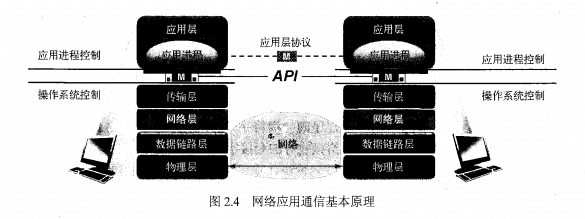
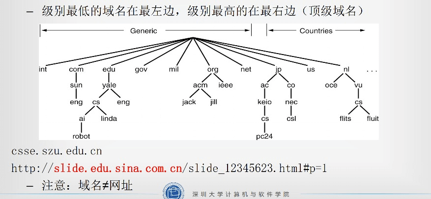
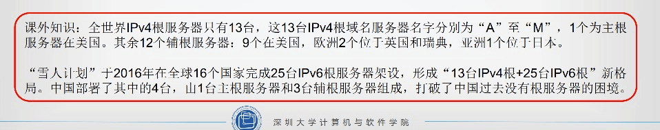
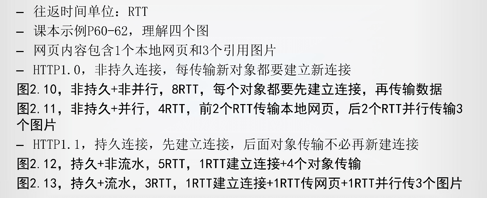

## 第二章 网络应用

### 2.1 网络应用体系结构

三种体系结构

#### C/S 结构

- 客户/服务器（C/S）结构，最基本最典型的网络应用结构
- 客户程序+服务器程序
- 主要特征
  - 网路通信只在客户与服务器之间进行
  - 客户之间相互不同信
  - 客户端主动发起通信，服务器端被动接受通信

#### P2P 结构

- 所有通信都是对等的通信方之间进行，没有客户与服务器之分，地位对等。
- P2P 的每个对等端是客户与服务器的结合体
- 应用：文件分发、文件共享、视频流服务、BitTorent、Gnutella

#### 混合结构

- C/S 和 P2P 相结合，既有服务器的存在也有对等端客户的直接通信

### 2.2 网络应用通信基本原理

1. 应用层通信过程：应用进程之间以 C/S 方式进行通信
   - 服务器进程被动等待客户通信
   - 客户进程主动发起通信
2. 在逻辑上，是两个应用层的进程直接交换数据，实际上应用层程序通过层间接口 API，往下传递数据给传输层，按照五层模型的方式来交换信息。  
   
3. 典型的网络应用编程接口：套接字（Socket）
   - 一个应用进程对多个传输层协议
   - 每个协议对应一个接口，每个接口用一个 socket 进行绑定
4. 系统为每个套接字分配一个编号，就是端口号 port number
   - 服务器进程的端口号是特定的
   - 客户进程的端口号是随机分配且唯一
   - 例如 WEB 端口号 80
5. 应用层需要使用传输层的服务，传输层提供两种服务
   - TCP，面向连接，可靠，字节流传输服务
   - UDP，无连接，不可靠，数据报文传输服务

### 2.3 域名系统（DNS）

#### IP 地址与域名

- 主机 IP 地址
  - 为了确保通信时能相互识别，在 Internet 上的每台主机都必须有一个唯一的标识，即主机的 IP 地址。
  - 在网络层，IP 协议就是根据 IP 地址实现信息传递的。
  - IP 地址由 32 位（即 4 字节）二进制数组成，通常书写时以四组十进制数字组成，并以点分隔，如：`172.16.254.1` 。
- 普通用户不习惯记忆和使用 IP 地址，因此希望网络地址更加容易记忆，因此设计了域名，更加容易记忆。
- 域名系统就是：将域名和它的 IP 地址之间建立起一种映射关系
  - 域名由多个分量组成， 各分量之间用“ .” 分隔开
  - 各分量代表不同级别的域名
  - 级别最低的域名在最左边， 级别最高的在最右边（ 顶级域名）
  - 每一级域名由英文字母或数字组成  
    n 级域名.n-1 级域名. n-2 级域名………顶级域名
- 域名结构
  
- `**域名层次化域名空间**`
  - 国家顶级域名： .cn \ .us \ uk
  - 通用顶级域名： .com \ .net \ .gov \ .edu
  - 基础结构域名： arpa

#### DNS

- Internet 上的域名由域名系统 DNS(Domain Name System)统一管理
- DNS 是一个分布式数据库系统， 包含三部分：
  - 域名空间
  - 域名服务器
  - 地址转换请求程序
- 有了 DNS， 凡域名空间中有定义的域名可以有效地转换为对应的 IP 地址， 同样， IP 地址也可通过 DNS 转换成域名。
- DNS 服务器的组织方式， 包含`四种类型的 DNS 服务器`：
  - 根域名服务器： 因特网上共有 13 个根 DNS 服务器；根域名服务器不做域名解析， 它知道所有顶级域服务器的 IP 地址。
  - 顶级域名服务器
  - 权威域名服务器
  - 中间域名服务器
  - 每台主机都会配置一个默认域名服务器， 即*本地域名服务器*
    

#### 域名解析过程

- 本地域名服务器—>根域名服务器—>顶级域名服务器—>权威域名服务器
- 递归查询， 每次查询由其他域名服务器转发查询
- 迭代查询， 每次查询由本地域名服务器和其他域名服务器直接对话
- 改进域名系统查询效率： 域名服务器增加缓存机制

### 2.4 万维网

#### WWW

- WWW 是 World Wide Web 的缩写， 也简称 Web， 从用户角度来看， Web 是由数量巨大且遍布全球的文档组成， 这些文档称为 Web 页（Web page） 。
- 万维网简称 Web 应用， 组成部分
  - Web 服务器
  - 浏览器
  - 超文本传输协议 HTTP
- URL
  - URL 是为了在因特网上查询不同信息资源有统一的访问方法， 而定义的一种地址标识方法。
  - 因特网上所有资源都有一个 URL 地址， 而且是独一无二的
  - URL 的完整格式： 主机域名+对象路径名
    协议： //主机名或 IP 地址:端口号/路径名/文件名

#### HTTP

1. HTTP 协议
   浏览器与 Web 服务器之间通信使用的协议， 规定了客户方与服务器方通信所使用的命令及响应。
   - HTTP1.0， 第一个广泛应用的版本
   - HTTP1.1， 目前 Web 应用最广泛的 HTTP 版本
   - HTTP2.0， 最新版本， 尚未广泛应用
2. HTTP 连接
   - HTTP1.0，非持久连接
   - HTTP1.0，非持久+并行连接
   - HTTP1.1，非流水方式持久连接
   - HTTP1.1，流水方式持久连接
     
3. HTTP 报文
   报文由 4 部分组成，起始行和空白行是不可缺少。  
   报文类型：请求报文、响应报文
   - 两种报文结构
   - 两种报文的区别
   - HTTP 请求方法
   - HTTP 状态码表

#### Cookie

1. HTTP 是无状态协议， Web 应用引入 Cookie 机制跟踪用户
2. Cookie， 一种小型文本文件， 用于网络应用的身份识别、 会话跟踪等功能， 存储在用户本地终端。
3. Cookie 工作原理， 四类 Cookie 信息， 理解图 2.16
   - 客户端 Cookie 信息（ 文本文件）
   - 服务器端 Cookie 信息（ 数据库）
   - 响应报文携带的 Cookie 信息
   - 请求报文携带的 Cookie 信息
4. Cookie 分类： 会话 Cookie、 永久 Cookie

### 2.5 电子邮件

#### 电子邮件系统结构

- 邮件服务器
- 用户代理
- 简单邮件传输协议 SMTP
- 邮件读取协议

#### SMTP

SMIP 是 Internet 电子邮件中核心应用层协议，实现邮件服务器之间或用户代理到邮件服务器之间的邮件传输。SMIP 使用传输层 TCP 实现可靠数据传输。

#### 邮件格式与 MIME

多用途互联网邮件扩展（Multipurpose Internet Mail Extensions, MIME）。  
由于 SMIP 只能传输 7 位 ASCII 码文本内容，所以传输非 7 位的 ASCII 码文本时，必须依据一个标准将非 7 位转化为 7 位 ASCII 码文本。解决该问题的方案就是 MIME，目前已经广泛应用于互联网的邮件之中。

#### 邮件读取协议

由于 SMTP 是”推动“协议，不能用于读取邮件，当用户读取邮件时，所使用的应用层协议是邮件读取协议。  
目前 Internet 邮件系统中比较流行的邮件读取协议有第三版的邮局协议（Post Office Protocol-Version 3, POP3）、互联网邮件访问协议（Internet Mail Access Protocol, IMAP）和 HTTP，其中 HTTP 被用作 Web Mail 系统中的邮件读取协议。

- POP3
- IMAP （收邮件协议）
- HTTP

### 2.6 FTP

文件传输协议（File Transfer Protocol, FTP）是在互联网的两个主机间实现文件互传的网络应用，其应用层协议也称为 FTP。

- 使用 FTP 服务时，首先客户进程需要请求与 FTP 服务器的 21 号端口建立一条 TCP 连接，称为控制连接，然后开始 FTP 会话。
- FTP 的显著特点是在传输文件内容时，需要新建一个数据连接。服务器进程用自己传送数据的熟知端口号（20）与客户进程所提供的端口号建立数据连接。

### 2.7 P2P

P2P 应用：BitTorent、PPlive、Ppstream  
P2P 在文件分发、文件共享等应用表现优异性能。

### 2.8 Socket 编程基础

- Internet 应用最广泛的互联网应用编程接口：Socket API
- 识记 Socket API 函数
  - 创建套接字—int socket
  - 绑定套接字——bind函数
- Socket API 调用过程

### 应用层常见协议与端口

- DNS—53
- HTTP-80
- SMTP-25 / POP3-110
- FTP 控制-21/FTP 数据-20
