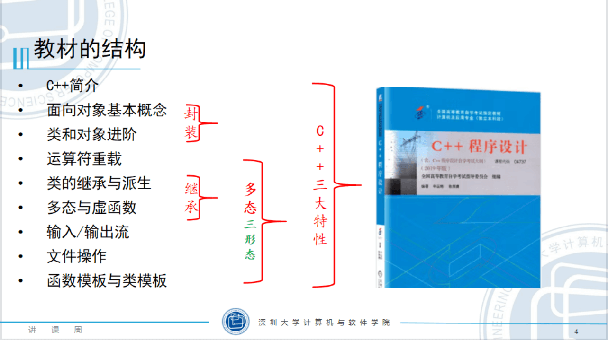

[课程讲师：白鉴聪](https://csse.szu.edu.cn/pages/user/index?id=1214)

**课程简介**
《C++程序设计》是计算机专业的核心课程之一，是程序设计的基础课程，是开发类职业的重要知识基础。课程需要学生掌握 C++编程知识，识记较少，主要考核读代码和编写简单程序的能力。

**考试题型**
选择题（20 题，20 分），填空题（15 题，15 分），程序填空（4 题，20 分），程序分析（6 题，30 分），程序设计（15 分）

**章节优先级排序**
2+5-->1+3+4+6+9-->7+8


## 第一章 C++简介

1. C++语言的发展简史
   - 随着 20 世纪 40 年代计算机的面世，计算机程序设计语言也应用而生。通常根据是否可以直接操作计算机底层硬件，将程序设计语言分为低级语言、中级语言和高级语言。
     - 机器语言和汇编语言属于低级语言一类，因为他们能够直接操作计算机的寄存器和内存。
     - 汇编语言使用能够代表指令的助记符来编写程序，可以看作是符号化了的机器语言。
     - 高级语言是面向用户的语言，很多语言在形式上接近算术语言和自然语言，程序员编写方便。使用高级语言编写的程序易读且通用性强，但大部分不能直接与硬件打交道，也不能直接在计算机上运行，需要系统软件的支持，如需要编译程序及链接程序将高级语言编译链接为机器指令后才能运行。
   - C++标准发展： C++03、C++11、C++14 和 C++17
2. C++语言的特点
   - 1.基本的输入输出
   - 2.头文件和命名空间
     - `using namespage std`表示使用命名空间 std
   - 3.强制类型转换运算符
     - `staic_cast<类型名>(表达式)` 用于将一种数据类型转化为另一个数据类型
     - `const_cast<类型名>(表达式)` 用于去除指针和引用的常量性，但不能去除变量的常量性
   - 4.函数参数的默认值
   - 5.引用和函数参数的传递
     - 1.引用定义`类型名 &引用名 = 同类型的某变量名`
     - 2.引用在函数中的作用
       - 引用作为函数返回值：`数据类型 & 函数名(参数列表)`
       - 函数的返回值还可以是指针：`类型标识符 * 函数名(参数列表)`
   - 6.const 与指针共同使用
   - 7.内联函数
     ```cpp
        inline 返回值类型 函数名(形参表)
        {
           函数体
        }
     ```
   - 8.函数重载
   - 9.指针和内存动态分配
     - `指针指向一个地址`
   - 10.用 string 对象处理字符串
3. C++语言的程序结构
   - C++程序以.cpp 为文件扩展名。程序中必须要有一个主函数 main(),这是程序执行的总入口，程序从主函数的开始处执行，按照其控制结构，一直执行到结束。
   - 程序结束的两种情形：1.在主函数遇到 return；2.执行到主函数最后面的`}`。
   - 注释：单行注释`//`;多行注释`/* */`

## 第二章 面向对象的基本概念

1. 结构化程序设计
   - 在面对对象之前，软件界广泛流行的设计方法之一就是结构化设计，也称面向过程的设计方法。
   - 基本上程序都有顺序、选择、循环 3 中基本控制过程。有一个著名的公式体现了结构化程序设计的思想：`数据结构 + 算法 = 程序`
   - 缺点：函数复用十分困难；可能会有数目众多的全局变量和全局函数，模块间耦合度高，难以维护。
2. 面向对象程序设计的概念和特点
   - 面向对象方法是 20 世纪 90 年代以来软件开放的主流，它继承了结构化程序设计方法的优点，又改善了结构化程序的不足。
   - 面向对象 4 个基本特点：“抽象”、“封装”、“继承”、“多态”。
     - 将同一类事物的共同特点概括出来，这个过程就叫做“抽象”。类是对现实世界中客观事物的抽象。
     - 在完成抽象后(即定义为一个类之后)，再定义类的对象，每个对象包含了这个类规定的若干私有成员、公有成员、保护成员。这个过程就叫“封装”。
       - 封装体现的特点是将对象的属性及实现细节隐藏起来，只给出如何使用的信息。有了封装机制，对象内部的实现细节受到保护，公开的信息成为与外界交互的`接口`。`对象是类的实例`。
     - “继承”就是在编写一个“新”类的时候，以现有的类为基础，使得新类从现有的类“派生”出来，从而到达代码扩充和代码复用目的。
     - “多态”是指不同种类的对象具有名称相同的行为，而具体行为的实现方式却有所不同。多态性源于一个希腊单词，意思是“许多形态”。
       - 继承性与多态性的组合，可以轻易地生成一系列虽然类似但独一无二的对象。由于继承，这些对象有共同特性；由于多态，不同的对象可以有不同的独特的表现方式。
3. 类的初步知识
   - 类的定义格式
   ```cpp
   class 类名
   {
       访问范围说明符：
           成员变量 1
           成员变量 2
           ...
           成员函数声明1
           成员函数声明2
           ...
       访问范围说明符:
           更多成员变量
           更多成员函数声明
           ...
   };
   ```
   - 类的成员函数定义格式
   ```cpp
   返回值类型 类名::成员函数名(参数表)
   {
      函数体
   }
   ```
4. 类的示例程序剖析
   - 1.程序结构
     - 一个完整的 C++程序包括几个部分：1.主函数；2.用户定义的任意多个类及全局函数；3.全局说明；4.注释；5.头文件(.h 文件)；
     - 函数的非内联函数不能放在头文件中
   - 2.成员变量与成员函数的定义
   - 3.创建类对象的基本形式
5. 访问对象的成员
   - 1.使用对象访问成员变量与调用成员函数
   - 2.使用指针访问对象成员
     - 格式`指针->成员名`
   - 3.使用引用访问对象的成员
   - 访问示例
   ```cpp
   class A
   {
       public:
           int x;
   }
   //1、使用对象访问 (点运算符)
   A.x;
   //2. 使用指针访问（箭头运算符）
   A a1;
   A *p = &a1;
   p -> a1
   //3. 使用引用访问
   A &s = a1; //a1的别名s
   ```
6. 类成员的可访问范围
   - `public、private、protected`
   - public 修饰的成员可以在本程序的任何地方被访问
   - private 修饰的成员`仅仅能在本类中访问`
     - 使用 private 修饰符可以实现“隐藏”的作用，避免对对象的不正常操作。
   - protected 修饰的成员`在本类及子类中可以被访问`
7. 标识符的作用域与可见性
   - 标识符
     - 标识符：如类名、函数名、变量名、常量名和枚举类型的取值等等
     - 标识符的作用域：1.函数原型作用域、2.局部作用域(块作用域)、3.类作用域、4.命名空间作用域
   - 可见性原则
     - 1.标识符要声明在前，引用在后
     - 2.同一个作用域中，不能声明同名的标识符。没有包含关系的作用域中命名同名标识符，互不影响。
     - 3.如果存在多个具有包含关系的作用域，声明的同名标识符，内层标识符会隐藏外层同名标识符。

## 第三章 类和对象进阶

1. 构造函数

   - 1.构造函数的作用：`给对象初始化的时候赋值`
   - 2.构造函数的定义（3 种形式）

   ```cpp
      //形式1
      类名::类名(形参1、、、形参n):x1(形参1)、、、xn(形参n){}

      //形式2
      类名::类名(形参1、、、形参n)
      {
         x1 = 形参1;
         、、、
         xn = 形参n；
      }

      //形式3
       类名::类名()
      {
         x1 = 初始值1;
         、、、
         xn = 初始值n;
      }
   ```

   - 3.构造函数使用
     - 构造函数由系统自动调用，不由程序员控制。因为对象需要占据内存空间，生成对象时，为对象分配的这段内存空间的初始化由构造函数完成。
   - 4.复制构造函数与类型转换构造函数

   ```cpp
   class 类名
   {
   public:
       类名(类名 & 对象名) //复制构造函数

   };

   类名::类名(类名 & 对象名) //复制构造函数的实现
   {
       函数体
   }
   ```

2. 析构函数
   - 与构造函数一样，析构函数也是成员函数的一种，它的名称与类名相同但是要在类名前面加`~`字符。
   - 构造函数没有参数、没有返回值。一个类有且仅有一个析构函数。
   - 使用`new运算符`号创建的对象，则要在析构函数中使用`delete`释放掉这部分占用的空间
3. 类的静态成员
   1.静态变量
      - 使用`static`修饰
   2.类的静态成员
      - 赋值格式：`类型 类名::静态成员变量 = 初值；`
      - 取值：`类名::静态成员名`或`对象名.静态成员名`或`对象指针->静态成员名`
      - 类的静态成员函数没有this指针
4. 变量及对象的生存期和作用域
5. 常量成员和常引用成员
   - 定义常量对象的格式：`const 数据类型 常量名 = 表达式`
   - 定义常量函数的格式：`类型说明符 函数名(参数表) const`
   - 常量对象只能调用常量函数
6. 成员对象和封闭类
   - 一个类的成员变量如果是另一个类的对象，则该成员变量称为“成员对象”，包含成员对象的类叫做“封闭类”。
   - **封闭类的复制构造函数**
7. 友元
   - 友元机制是对一些类外的函数打开的一个特殊通道，授权它们能够访问本类的私有成员变量。使用`friend`标识
   - 将类A的成员函数说明为本类的友元函数的格式：`friend 返回值类型 类A::类A的成员函数名(参数表);`
   - 友元类：`friend class 类名`
8. this 指针
   - C++语言规定，当调用一个成员函数时，系统自动向它传递一个隐含的参数。该参数是一个指向调用该函数的对象的指针，称为`this指针`。

### 第四章 运算符重载

1. 运算符重载的概念
   - 运算符重载格式：
   ```cpp
        返回值类型  operator 运算符(形参表)
        {
            函数体
        }
   ```
2. 重载赋值运算符
3. 重载流插入运算符和流提取运算符
4. 重载强制类型转换运算符
5. 重载自增、自减运算符

### 第五章 类的继承与派生

1. 类的继承与类的派生  
   在程序设计方法中，人们追求代码复用（提高软件开发效率的重要手段），将继承和派生用于程序设计方法中，从而有了面向对象程序设计的重要特点。C++对代码复用有很强的支持，“继承”就是支持代码复用的机制之一。  
   继承与派生有相同的含义，不同的角度。继承对应于自下而上的过程，派生对应于自上而下的过程。从基类的角度看，是派生了子类。从子类的角度看，是继承于基类。
   ```cpp
   class 派生类名 ：继承方式说明符 基类名
   {
       类体
   };
   ```
   多重继承
   ```cpp
   class 派生类名 ：继承方式说明符 基类名1, 继承方式说明符 基类名2, ..., 继承方式说明符 基类名n
   {
       类体
   };
   ```
2. 访问控制
3. 派生类的构造函数和析构函数
4. 类之间的关系
   - 继承关系和组合关系
   - 封闭类
   - 互包含关系的类
5. 多层次的派生
6. 基类与派生类指针的互相转换

### 第六章 多态与虚函数

1. 多态的基本概念
   - 1.多态
     - 面向对象设计语言有封装、继承、多态 3 种机制。
     - 多态分文编译时多态和运行时多态。编译时多态是指函数的重载，对重载函数的调用，在编译时就可以根据实参确定应该调用哪个函数。运行时多态则和继承、虚函数等概念有关。
     - 多态体现`一样的语句，不一样的执行效果`
   - 2.虚函数
     - 格式：`virtual  函数返回值类型  函数名(形参表)`
     - 有几点需要注意：
       - 1.虚函数一般不声明为内联函数，虽然不会报错
       - 2.派生类重写基类虚函数，要求函数名、参数列表、返回值类型要完全相同
       - 3.只有类的非静态成员才能定义为虚函数，静态成员函数和友元函数不能定义为虚函数
       - 4.如果在类体外定义虚函数，只需在声明函数时添加`virtual`关键字，定义时不用加
       - 5.构造函数不能定义为虚函数。最好也不要将`operator=`定义为虚函数
       - 6.不要在构造函数和析构函数中调用虚函数。此时对象是不完整的，可能出现未定义的行为。
       - 7.最好将基类的析构函数声明为虚函数。
     - 常见不能声明为虚函数的有：全局函数（非成员函数）、静态成员函数、内联成员函数、构造函数和友元函数。
   - 3.通过基类指针实现多态
   - 4.通过基类引用实现多态
   - **5.多态的实现原理**
     - 多态的关键在于通过基类指针或引用调用一个虚函数时，编译阶段不能确定到底调用的是基类还是派生类的函数，运行时才能确定。
2. 多态实例
3. 多态的使用
4. 虚析构函数
   - 格式：`virtual ~类名();`
   - 使用需析构函数的目的是为了在对象消亡是实现多态。可以用来保证使用基类类型的指针对不同对象进行清理过程，防止内存泄露。
5. 纯虚函数和抽象类
   - 纯虚函数
     - 格式：`virtual 函数类型 函数名(参数表)=0;`
   - 抽象类
     - 包含纯虚函数的类称为抽象类。
     - 因为抽象类中有尚未完成的函数定义，所以不能实例化对象。抽象类的派生类中，如果没有给出全部纯虚函数的定义，则依然是抽象类。
     - 不能实例化对象，但是可以定义抽象类的指针和引用。

### 第七章 输入/输出流

1. 流类简介
2. 标准流对象
3. 控制 I/O 格式
4. 调用 cout 的成员函数
5. 调用 cin 的成员函数

### 第八章 文件操作

1. 文件基本概念和文件流类
2. 打开和关闭文件
3. 文件读写操作
4. 随机访问文件

### 第九章 函数模板与类模板

1. 函数模板
2. 类模板
