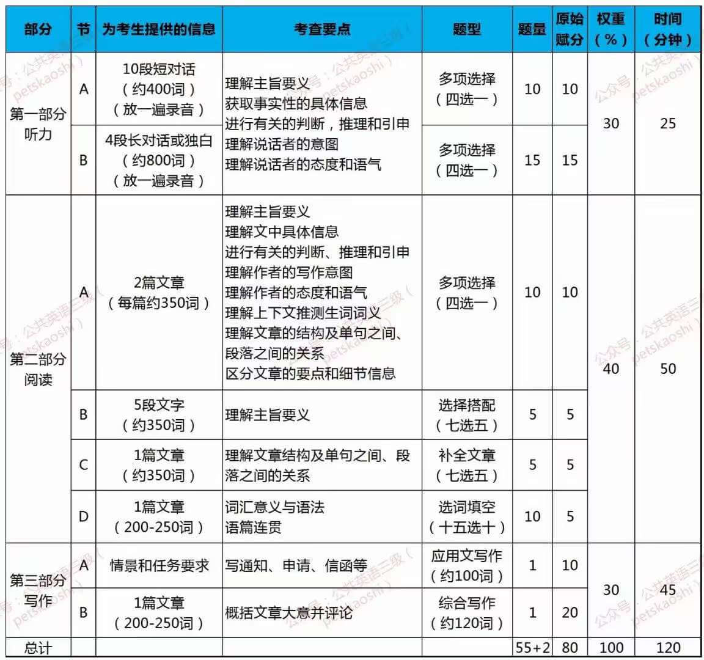

## PETS-3

- [全国英语等级考试(Public English Test System, 简称 PETS)](https://pets.neea.edu.cn/)
- [大纲教材](https://pets.neea.edu.cn/html1/folder/16093/1175-1.htm)

## 备考

- [公共英语 3 级 PETS3 备考经验](https://zhuanlan.zhihu.com/p/414809626)

## 考试介绍

考试分为笔试和口试

1. 笔试题型

- [听力](https://mp.weixin.qq.com/s/4y5fTe-iqHGffc_u-I1fiQ)
- [阅读](https://mp.weixin.qq.com/s/Q1zfR18Scmbb02NxkXJ70A)
- [写作](https://mp.weixin.qq.com/s/3m9I1pZVbaFSj9uxNXObOA)

2. [口试题型](https://mp.weixin.qq.com/s/ve-ntJhjzoRSSabWD4uBkA)
