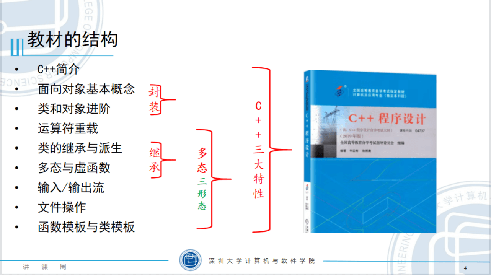

## 课程介绍

**课程简介**

- 《C++程序设计》是计算机专业的核心课程之一，是程序设计的基础课程，是开发类职业的重要知识基础。课程需要学生掌握 C++编程知识，识记较少，主要考核读代码和编写简单程序的能力。
- 采用教材：《C++程序设计》2019年版；课程代码：04737

**课程讲师**

- [白老师](https://csse.szu.edu.cn/pages/user/index?id=1214)

**考试题型**
- 选择题（20 题，20 分）
- 填空题（15 题，15 分）
- 程序填空（4 题，20 分）
- 程序分析（6 题，30 分）
- 程序设计（15 分）

**章节优先级排序**

- 2+5-->1+3+4+6+9-->7+8
  
