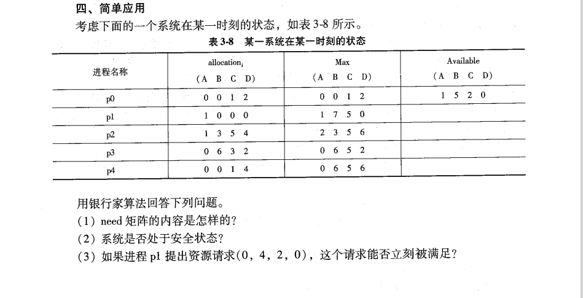

# 第 2 章 进程管理

1. 有两个进程 pA、pB 合作解决文件打印问题：pA 将文件记录从磁盘读入主存的缓存区，每执行一次读一个记录；pB 将缓冲区的内容打印出来，每执行一次打印一个记录。缓冲区的大小等于一个记录大小。请用记录型信号量机制的 wait(s)和 signal(s)操作来保证文件的正确打印，并写出同步代码。

   ```c
      //为缓存区设置互斥信号量mutex, 设置资源信号量empty和full。3个信号量的初始值如下：

      mutex.value = 1
      empty.value = 1
      full.value = 0

      pA {
        从文件中读一条记录;
        wait(empty);
        wait(mutex);
        将数据写入缓冲区;
        signal(full);
        signal(mutex);
      }

      pB {
        wait(full);
        wait(mutex);
        读缓冲区的内容;
        signal(mutex);
        signal(empty);
        内容打印;
      }
   ```

# 第 3 章 进程调度与死锁
- 