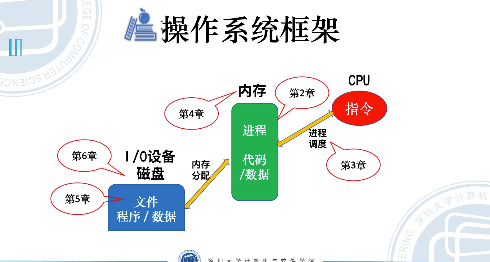

[课程讲师：白鉴聪](https://csse.szu.edu.cn/pages/user/index?id=1214)

## 操作系统框架

## 背景知识

- [计算机体系结构](https://lulaoshi.info/gpu/gpu-basic/computer-arch.html)

## 课程章节概述

1. 第一章 操作系统简介

   - 1.什么是操作系统？

     - 操作系统是一种复杂的软件系统，是不同程序代码、数据结构、数据初始化文件的集合，可执行。

   - 2.操作系统的发展

     - 无操作系统 -> 单道批处理系统 -> 多道程序系统

   - 3.操作系统的特征
   - 4.操作系统的功能
   - 5.操作系统的体系结构
   - 6.CPU 的逻辑结构与指令的执行

2. 第二章 进程管理
   - 1.进程的描述与组织
   - 2.进程的控制
   - 3.操作系统内核
   - 4.线程的描述与控制
   - 5.进程同步
   - 6.进程间通信
3. 第三章 进程调度与死锁
   - 1.进程调度的功能与时机
   - 2.进程调度算法
   - 3.实时系统中的调度
   - 4.多处理机调度
   - 5.产生死锁的原因和必要条件
   - 6.处理死锁的基本方法
4. 第四章 内存管理
   - 1.存储器的层次结构与局部性原理
   - 2.程序的链接和装入
   - 3.连续内存管理方式
   - 4.分页存储管理
   - 5.分段存储管理
   - 6.段页式存储管理
   - 7.基于分页的虚拟存储管理
   - 8.伙伴系统
5. 第五章 文件系统
   - 1.文件系统概述
   - 2.目录
   - 3.文件系统的实现
6. 第六章 I/O 设备管理
   - 1.I/O 系统的组成
   - 2.输入/输出的控制方式
   - 3.缓冲管理
   - 4.设备分配
   - 5.设备管理软件的构成
   - 6.磁盘管理

## 考试题型

- 1.单选题（20\*1，20 分）
- 2.填空题（10\*2，20 分）
- 3.简答题（5\*4，20 分）
- 4.综合题（4\*10，40 分）
- 

## 考试重点

- 2、3、4 章节，占分值约 60 分
- 进程管理重点难点：进程同步
- 内存管理：重点掌握“基本分页管理”的计算原理

## 教程简介

全国高等教育自学考试指定教材，操作系统概论（2017 年版）
