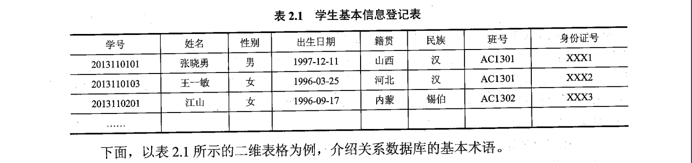
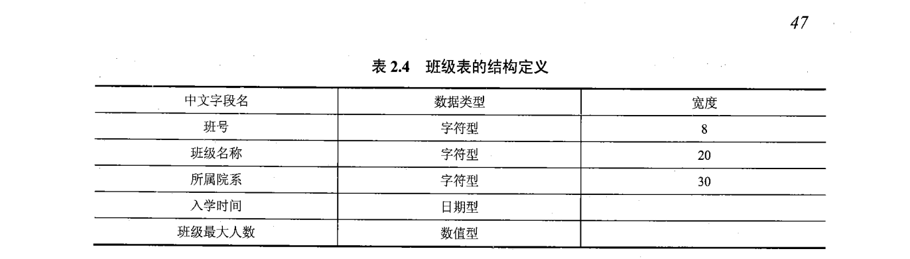
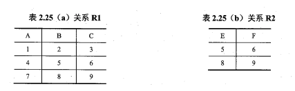
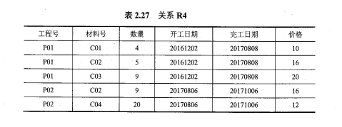

## 2.1 关系数据库概论

1. 关系数据库

   - 关系数据库是目前应用`最广泛`的数据库，它以`关系模型`作为数据的逻辑模型，采用关系作为数据的组织方式，其数据库操作`建立在关系代数的基础`上，具有坚实的`数学`基础。具有较高的数据独立性，当数据的存储结构发生变化时，不会影响应用程序，可以大大减少系统维护的工作量。
   - 关系数据库的`基本特征`是使用关系数据模型组织数据。
   - 这种思想来源于数学。

2. 关系数据库的发展

   - 美国 IBM 公司的 E.F.Codd 在`1970年`系统、严格地提出了关系模型，开创数据库系统的新纪元。
   - 20 世纪`70年代末`，关系方法的理论研究和软件系统的研制才取得重大突破。
   - `80年代以后`，关系模型逐渐取代早期的网状模型和层次模型，成为`主流数据模型`。

3. 常见的关系型数据库
   - Oracle、Sybase、Informix、IBM DB2、MS SQL Server、FoxPro、Accress、MySQL。

## 2.2 关系数据模型

1. 关系数据结构

   - 关系模型的组成元素

     - `关系模型包括三个组成元素`：1）关系数据结构；2）关系操作集合；3）关系完整性约束

   - 关系数据结构

     - 关系模型的数据结构非常简单，只包含`单一的数据结构`，即`关系`。
     - 在关系模型中，现实世界的实体以及实体间的各种联系，均是使用`关系`来表示。
     - 在用户看来，关系模型`是把数据库表示为关系的集合`，且关系数据库是以`二维表格`的形式组织数据。

   - 关系数据库的基本术语

     - 
     - 1）表（Table）也称关系，是一个二维的数据结构，由表名、构成表的各个列及若干行数据组成。每个表有唯一的表名，表中的每一行数据描述一条具体的记录值。
     - 2）关系（Relation）：一个关系逻辑上对应一张二维表。关系有三种类型：

       - 基本关系：又称基本表或基表，是实际存在的表，是实际存储数据的逻辑表示；
       - 查询表：查询结果对应的表；
       - 视图表：由基本表或其他视图表导出的表，是`虚表`，不对应实际存储的数据。

     - 3）列（Column）,表中的列，也称为字段或属性。表中的每一列有一个名称，称为列名、字段名或属性名。

       - 每一列表示实体的一个属性，具有相同的数据类型。
       - 在一个数据库中，表名必须唯一；在表中，字段名必须唯一，不同表中可以出现相同的字段名；表和字段的命名应尽量有意义，并尽量简单。

     - 4）属性（Attribute）:表中的一列为一个属性，给每个属性起一个名称即属性名。

       - `元或度`：表中属性的个数。
       - 属性值：列的值。
       - `值域`：属性值的取值范围。

     - 5）行（Row）

       - 表中的行，也称为`元组或记录`。表中的数据是按行存储。

     - 6）元组（Tuple）

       - `表中的一行`即为一个元组。

     - 7）分量（Component）

       - 元组中的一个属性值，称为分量。

     - 8）码或键（key）

       - 如果在一个关系中，存在这样的属性（或属性组），使得在该关系的任何一个关系状态中的两个元组，在该属性（或属性组）上值的组合都不相同，即这些属性（或属性组）的值都能用来唯一标识该关系的元组。

     - 9）**超码或超键（Super Key）**

       - 如果在关系的一个码中`移去某个属性，它仍然是这个关系的码`，则称这样的码或键为该关系的超码或超键。
       - 每个关系`至少有一个默认的超码`或超键，即该关系的所有属性的集合，也是这个关系的`最大超码`或超键。
       - 最大的超码：所有属性的集合。

     - 10）候选码或候选键（Candidate Key）

       - 如果在关系的一个码或键中，不能从中移去任何一个属性，否则它就不是这个关系的码或键，则称这样的码或键为该关系的候选码或候选键。
       - 可见一个关系的候选码或候选键是这个关系的`最小的超码`或超键。

     - 11）主码或主键

       - 在一个关系的若干个`候选码或候选键中指定一个用来唯一标识关系的元组`，则称这个被指定的候选码或候选键为该关系的主码或主键。

     - 12）全码或全键

       - 一个关系模式的`所有属性集合`是这个关系的主码或主键，则称这样的主码或主键为全码或全键。

     - 13）主属性和非主属性

       - 关系中包`含在任何一个候选码中的属性称为主属性`或码属性，不包含在任何一个候选码中的属性称为非主属性或非码属性。

     - 14）外码或外键

       - 当关系中的某个属性（或属性组）不是这个关系的主码或候选码，而是`另一个关系的主码`时，称该属性（或属性组）为这个关系的外码或外键。
       - 
       - 例如：在表 2.4 中班号是班级表的主键，而该属性又是表 2.1 学生信息基本表的一个属性，则属性班号称为学生信息基本表的外键。

     - 15）参照关系和被参照关系

       - 参照关系也称为从关系，`被参照关系也称为主关系`，它们是指以外码相关联的两个关系。
       - `以外码作为主码的关系称为被参照关系`；外码所在的关系称为参照关系。被参照关系与参照关系是通过外码相联系的。这种联系通常是一对多的联系。
       - 例如：表 2.4 定义的班级表是被参照关系

     - 16）域

       - 域表示属性的取值范围。

     - 17）数据类型

       - 表中每个列都有相应的数据类型，它用于限制该列中存储的数据。每个字段表示同一类信息，具有相同的数据类型。

     - 18）关系模式

       - 数据库也有“型”（type）和“值”（value）之分。在关系数据库中，`关系模式是型，关系是值，即关系模式是对关系的描述`。
       - 关系模式是静态的、稳定的、而关系是动态的、随时间不断变化的。这是因为关系操作在不断地更新着数据库中的数据。

     - 19）关系数据库
       - 是以关系模式作为数据的`逻辑模型`，并`采用关系作为数据组织方式`的一类数据库，其数据库操作建立在`关系代数`的基础上。
       - 在一个给定的应用领域中，所有关系的集合构成一个关系数据库。

   - 关系数据库对关系的限定

     - 1）每一个属性都是不可分解的。最基本的限定，要求关系的每一个分量必须是一个不可分的数据项。
     - 2）每一个关系仅仅有一种关系模式
     - 3）每一个关系模式中的属性必须命名，同一个关系模式中，属性名必须是不同的
     - 4）同一个关系中不允许出现候选码或候选键值完全相同的元组
     - 5）在关系中元组的顺序（即行序）是无关紧要的，可以任意交换
     - 6）在关系中属性的顺序（即列序）是无关紧要的，可以任意交换

2. 关系操作集合

   - 关系模型给出了关系操作的能力的说明，但不对关系数据库管理系统语言给出具体的语法要求，也就是说`不同的关系数据库管理系统可以定义和开发不同的语言`来实现这些操作。
   - 1.基本的关系操作

     - 常用的关系操作包括查询（Query）操作和插入(Insert)、删除(Delete)、修改(Update)操作两大部分。
     - 关系的查询表达能力很强，是关系操作中最主要的部分。
       - `查询操作又可以分为选择、投影、连接、除、并、差、交、笛卡尔积等。`
       - 其中，**选择、投影、并、差、笛卡尔积是 5 种基本操作**，其他操作均可以使用基本操作来定义和导出。
     - 关系操作的特点是集合操作方式，即操作的对象和结果都是集合。这种操作方式也称为一次一集合的方式。

   - 2.关系数据语言的分类

     - 关系操作是通过关系语言来实现的。
     - 关系操作的能力可以用两种方式来表示：`代数方式和逻辑方式`。
       - 代数方式主要有关系代数，它是通过对关系的操作来表达查询要求的方式；
       - 逻辑方式主要有关系演算，它是用谓词来表达查询要求的方式；
         - 关系演算又可按谓词变元的基本对象是元组变量还是域变量，分为元组关系演算和域关系演算。
         - 关系代数、元组演算、域关系演算三种语言在表达能力上是完全等价的。
     - 关系代数、元组演算、域关系演算均是抽象的查询语言。
     - 另外，还有一种介于关系代数和关系演算之间的结构化查询语言(SQL)
     - 因此，关系数据语言可以分为三类：关系代数语言、关系演算语言以及兼顾两者双重特点的语言（例如 SQL）。

   - 3.关系代数
     - 关系代数是关系操作语言的一种传统表示方式，以集合代数为基础发展起来，任何一种操作都是将一定的操作符作用于一定的操作对象上，得到预期的操作结果。因此操作包含三大要素：`操作对象`、`操作符`、`操作结果`。
     - 关系代数操作中，操作对象和操作结果均为关系。关系代数直接应用关系的运算来表达操作目的，而代数用到的运算符包括`集合运算符`和`专门的关系运算符`两类。
     - 关系代数操作经过`有限次复合的式子称为关系代数操作表达式，简称为关系代数表达式`。可以使用关系代数表达式表示所需要执行的各种数据库查询和修改处理。因而，关系代数也是一种抽象的查询语言，它通过对关系的操作来表达查询。

3. 传统的集合运算

   - 并
   - 差
   - 交
   - 笛卡尔积

4. 专门的关系运算

   - 专门的关系运算可分为一元专门关系操作和二元专门关系操作
     - 一元专门关系操作包括对单个关系进行垂直分解的投影运算和进行水平分解选择运算
     - 二元专门关系操作则是对两个关系进行操作，包括`连接`运算和`除`运算
   - **投影 π**
     - 投影运算是从指定的关系中选取指定的若干属性值组成一个新关系。
   - **选择 σ**

5. 关系的完整性约束

   - 1）实体完整性约束
   - 2）参照完整性约束
   - 3）用户定义完整性约束

6. 关系模型完整性约束的检验

- 执行插入操作（先检查实体，再参照，最后用户定义）；
- 执行删除操作（拒绝删除、空值删除、级联删除）；
- 执行更新操作（上述两种情况的综合）。

## 2.3 关系数据库的规范化理论

- 关系数据库的规范化理论是关系数据库设计的理论依据。
- 规范化理论研究的是关系式中各属性之间的依赖关系及其对关系模式性能的影响，探讨“好”的关系模式应该具备的性质，以及达到“好”的关系模式的设计算法。

1. 关系模式中可能存在的冗余和异常问题

   - 不好的关系模式可能会存在的问题：1）数据冗余；2）更新异常；3）插入异常；4）删除异常

2. 函数依赖与关键字

   - 函数依赖：函数依赖是指关系中属性间的对应关系

     - 1）完全函数依赖

       - 设 R 为任一给定关系，X,Y 为其属性集，若 X->Y，且对 X 中的**任何**真子集 X'满足 X'->Y，则称 Y 完全依赖于 X。

     - 2）部分函数依赖

       - 设 R 为任一给定关系，X,Y 为其属性集，若 X->Y，且 X 中**存在一个**真子集 X'满足 X'->Y，则称 Y 部分函数依赖于 X。

     - 3）传递函数依赖

       - 设 R 为任一给定关系，X,Y,Z 为其不同属性子集，若 X->Y，Y 不决定 X，Y->Z，则有 X->Z，称为 Z 传递函数依赖于 X。

   - 关键字

     - 设 R 为任一给定关系，U 为其所含的全部属性集合，X 为 U 的子集，若有完全函数依赖 X->U，则 X 为 R 的一个候选关键字。
     - 一个关系 R 中可能存在多个候选关键字，通常选择其中一个作为主关键字，即主键。候选关键字中所含有的属性称为主属性。

3. 范式与关系规范化过程

   - 1）第一范式，简称 1NF，是最基本的范式
     - 设 R 为任一给定关系，如果 R 中每个列与行的交点处的取值都是不可再分的基本元素，则 R 为第一范式。
   - 2）第二范式，2NF
     - 设 R 为任一给定关系，若 R 为 1NF，且其所有非主属性都完全函数依赖于候选关键字，则 R 为第二范式。
   - 3）第三范式，3NF
     - 设 R 为任一给定关系，若 R 为 2NF，且其每一个非主属性都不传递函数依赖于候选关键字，则 R 为第三范式。
   - 4）BCNF

4. 关系规范化理论的运用

## 思考与练习

- 简答题

1. 请简述关系数据库的基本特征

   - 关系数据库的基本特征是使用关系数据模型组织数据。

2. 请简述什么是参照完整性约束

   - 参照完整性约束是指：若属性或属性组 F 是基本关系 R 的外码，与基本关系 S 的主码 K 相对应，则对于 R 中每个元组在 F 上的取值只允许有两种可能，要么是空值，要么与 S 中某个元组的主码值对应。

3. 请简述关系规范化过程

   - 对于存在数据冗余、插入异常、删除异常问题的关系模式，应采取将一个关系模式分解为多个关系模式的方法进行处理。一个低一级范式的关系模式，通过模式分解可以转换为若干个高一级范式的关系模式，这就是所谓的规范化过程。

- 综合题

1. 设有如表 2.25 所示的两个关系 R1 和 R2，其中 R2 是从 R1 中经过关系运算所形成的结果，请给出该运算表达式。
   

2. 设有如表 2.26 所示的关系 R3，请给出其全部函数依赖及候选关键字。

   - 

3. 设有如表 2.27 所示的关系 R4，请依次回答下面的问题。
   - 
   - i）关系是第几范式？  
     ii）是否存在操作异常？若存在，则将该关系分解为高一级范式。分解完成的高级范式中是否可以避免分解前关系中存在的操作异常？

## 百日题库-主观题

- 【2018 年 10 月】简述用户定义完整性约束。

  - 用户定义的完整性约束是针对某一应用环境的完整性约束条件，它反映了某一具体应用所涉及的数据应满足的要求。关系模型提供定义和检验这类完整性规则的机制，其目的是用统一的方式由系统来处理它们，不再由应用程序来完成这项工作。在实际系统中，这类完整性规则一般在建立数据库表的同时进行定义，也可以由应用编程人员在各模块的具体编程中通过程序进行检查和控制。

- 【2019 年 10 月】简述实体完整性约束。

  - （1）实体完整性约束是指关系的主属性，即主码的组成不能为空，也就是关系的主属性不能是空值 NULL。
    （2）关系对应于现实世界中的实体集，而现实世界中的实体是可区分的，即说明每个实体具有唯一性标识。
    （3）在关系模型中，是使用主码作为唯一标识的，若假设主码取空值，则说明这个实体不可标识，即不可区分。

- 【2020 年 08 月】简述关系模型完整性约束的检验。

  - （1）执行插入操作
    当执行插入操作时，首先检查实体完整性约束，然后再检查参照完整性约束，最后检查用户定义完整性约束。
    （2）执行删除操作。
    当执行删除操作时，一般只需要对被参照关系检查参照完整性约束。
    （3）执行更新操作。
    当执行更新操作时，因为更新操作可看成是先执行删除操作，再执行插入操作，因此是上述两种情况的综合。

- 【2018 年 10 月】设有关系模式 R(读者号，姓名，单位号，单位名，图书号，书名，借阅日期，还书目期)存储读者借阅图书等信息。如果规定：每个读者只属于一个单位；每个读者可以借阅多本图书，每本图书也可以被多名读者借阅，每个读者也可以对某本图书多次借阅，但每个读者每本图书每天最多借一次。

  - 1.根据上述条件，写出模式 R 的关键字。（2 分）
    - 读者号，图书号，借阅日期
  - 2.R 最高属于第几范式，为什么？（2 分）
    - R∈1NF，因为存在非主属性对码的部分函数依赖。
  - 3.举例说明 R 在何种情况下会发生删除异常。（2 分）
    - 删除读者借阅图书信息时有可能把读者的基本信息也删除了。
  - 4.将 R 规范到 3NF。（4 分）
    - R1（读者号，姓名，单位号）
      R2（单位号，单位名）
      R3（图书号，书名）
      R4（读者号，图书号，借阅日期，还书日期）

- 【2020 年 08 月】设有关系模式 R（商品号，商品名，类号，类名，商店号，商店名，销售日期，售价）存储商店销售商品等信息。如果规定：每个商品只属于一个类别：每个商店可以销售多种商品，每种商品也可以在多个商店销售，同种商品可以有不同的售价，但每个商店的每种商品每天只能有一个售价。
  - 1.根据上述条件，写出模式 R 的关键字。（2 分）
    - 商品号，商店号，销售日期
  - 2.R 最高属于第几范式，为什么？（3 分）
    - R∈1NF，因为存在非主属性对码的部分函数依赖。
  - 3.举例说明 R 在何种情况下会发生删除异常。（2 分）
    - 删除销售信息时有可能把商品的基本信息也删除了。
  - 4.将 R 规范到 3NF。（3 分）
    - R1（商品号，商品名，类号）
      R2（类号，类名）
      R3（商店号，商店名）
      R4（商品号，商店号，销售日期，售价）
