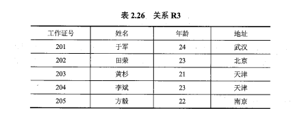

## 2.1 关系数据库概论

- 关系数据库的基本特征是使用关系数据模型组织数据，这种思想源于数学。

## 2.2 关系数据模型

1. 关系数据结构

   - 1）表
   - 2）关系
   - 3）列
   - 4）属性
   - 5）行
   - 6）元组
   - 7）分量
   - 8）码或键（key）
   - 9）超码或超键
   - 10）候选码或候选键
   - 11）主码或主键
   - 12）全码或全键
   - 13）主属性
   - 14）外码或外键
   - 15）参照关系和被参照关系
   - 16）域
   - 17）数据类型
   - 18）关系模式
   - 19）关系数据库

2. 关系操纵集合

   - 1.基本的关系操纵
   - 2.关系数据语言的分类
   - 3.关系代数

3. 关系的完整性约束

## 2.3 关系数据库的规范化理论

1. 关系模式中可能存在的冗余和异常问题

   - 不好的关系模式可能会存在的问题：1）数据冗余；2）更新异常；3）插入异常；4）删除异常

2. 函数依赖与关键字

   - 函数依赖：函数依赖是指关系中属性间的对应关系

     - 1）完全函数依赖

       - 设 R 为任一给定关系，X,Y 为其属性集，若 X->Y，且对 X 中的**任何**真子集 X'满足 X'->Y，则称 Y 完全依赖于 X。

     - 2）部分函数依赖

       - 设 R 为任一给定关系，X,Y 为其属性集，若 X->Y，且 X 中**存在一个**真子集 X'满足 X'->Y，则称 Y 部分函数依赖于 X。

     - 3）传递函数依赖

       - 设 R 为任一给定关系，X,Y,Z 为其不同属性子集，若 X->Y，Y 不决定 X，Y->Z，则有 X->Z，称为 Z 传递函数依赖于 X。

   - 关键字

     - 设 R 为任一给定关系，U 为其所含的全部属性集合，X 为 U 的子集，若有完全函数依赖 X->U，则 X 为 R 的一个候选关键字。
     - 一个关系 R 中可能存在多个候选关键字，通常选择其中一个作为主关键字，即主键。候选关键字中所含有的属性称为主属性。

3. 范式与关系规范化过程

   - 1）第一范式，简称 1NF，是最基本的范式
   - 2. 第二范式，2NF
   - 3. 第三范式，3NF

4. 关系规范化理论的运用

## 课后习题-简答题

1. 请简述关系数据库的基本特征

   - 关系数据库的基本特征是使用关系数据模型组织数据。

2. 请简述什么是参照完整性约束

   - 参照完整性约束是指：若属性或属性组 F 是基本关系 R 的外码，与基本关系 S 的主码 K 相对应，则对于 R 中每个元组在 F 上的取值只允许有两种可能，要么是空值，要么与 S 中某个元组的主码值对应。

3. 请简述关系规范化过程

   - 对于存在数据冗余、插入异常、删除异常问题的关系模式，应采取将一个关系模式分解为多个关系模式的方法进行处理。一个低一级范式的关系模式，通过模式分解可以转换为若干个高一级范式的关系模式，这就是所谓的规范化过程。

## 课后习题-综合题

1. 设有如表 2.25 所示的两个关系 R1 和 R2，其中 R2 是从 R1 中经过关系运算所形成的结果，请给出该运算表达式。
   

2. 设有如表 2.26 所示的关系 R3，请给出其全部函数依赖及候选关键字。

   - 

3. 设有如表 2.27 所示的关系 R4，请依次回答下面的问题。
   - 
   - i）关系是第几范式？  
     ii）是否存在操作异常？若存在，则将该关系分解为高一级范式。分解完成的高级范式中是否可以避免分解前关系中存在的操作异常？

## 百日题库-主观题

- 【2018 年 10 月】简述用户定义完整性约束。

  - 用户定义的完整性约束是针对某一应用环境的完整性约束条件，它反映了某一具体应用所涉及的数据应满足的要求。关系模型提供定义和检验这类完整性规则的机制，其目的是用统一的方式由系统来处理它们，不再由应用程序来完成这项工作。在实际系统中，这类完整性规则一般在建立数据库表的同时进行定义，也可以由应用编程人员在各模块的具体编程中通过程序进行检查和控制。

- 【2019 年 10 月】简述实体完整性约束。

  - （1）实体完整性约束是指关系的主属性，即主码的组成不能为空，也就是关系的主属性不能是空值 NULL。
    （2）关系对应于现实世界中的实体集，而现实世界中的实体是可区分的，即说明每个实体具有唯一性标识。
    （3）在关系模型中，是使用主码作为唯一标识的，若假设主码取空值，则说明这个实体不可标识，即不可区分。

- 【2020 年 08 月】简述关系模型完整性约束的检验。

  - （1）执行插入操作
    当执行插入操作时，首先检查实体完整性约束，然后再检查参照完整性约束，最后检查用户定义完整性约束。
    （2）执行删除操作。
    当执行删除操作时，一般只需要对被参照关系检查参照完整性约束。
    （3）执行更新操作。
    当执行更新操作时，因为更新操作可看成是先执行删除操作，再执行插入操作，因此是上述两种情况的综合。

- 【2018 年 10 月】设有关系模式 R(读者号，姓名，单位号，单位名，图书号，书名，借阅日期，还书目期)存储读者借阅图书等信息。如果规定：每个读者只属于一个单位；每个读者可以借阅多本图书，每本图书也可以被多名读者借阅，每个读者也可以对某本图书多次借阅，但每个读者每本图书每天最多借一次。

  - 1.根据上述条件，写出模式 R 的关键字。（2 分）
    - 读者号，图书号，借阅日期
  - 2.R 最高属于第几范式，为什么？（2 分）
    - R∈1NF，因为存在非主属性对码的部分函数依赖。
  - 3.举例说明 R 在何种情况下会发生删除异常。（2 分）
    - 删除读者借阅图书信息时有可能把读者的基本信息也删除了。
  - 4.将 R 规范到 3NF。（4 分）
    - R1（读者号，姓名，单位号）
      R2（单位号，单位名）
      R3（图书号，书名）
      R4（读者号，图书号，借阅日期，还书日期）

- 【2020 年 08 月】设有关系模式 R（商品号，商品名，类号，类名，商店号，商店名，销售日期，售价）存储商店销售商品等信息。如果规定：每个商品只属于一个类别：每个商店可以销售多种商品，每种商品也可以在多个商店销售，同种商品可以有不同的售价，但每个商店的每种商品每天只能有一个售价。
  - 1.根据上述条件，写出模式 R 的关键字。（2 分）
    - 商品号，商店号，销售日期
  - 2.R 最高属于第几范式，为什么？（3 分）
    - R∈1NF，因为存在非主属性对码的部分函数依赖。
  - 3.举例说明 R 在何种情况下会发生删除异常。（2 分）
    - 删除销售信息时有可能把商品的基本信息也删除了。
  - 4.将 R 规范到 3NF。（3 分）
    - R1（商品号，商品名，类号）
      R2（类号，类名）
      R3（商店号，商店名）
      R4（商品号，商店号，销售日期，售价）
