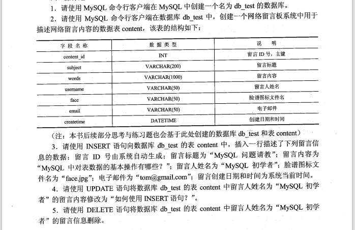

## 课后习题

- 选择题

1. 可用于从表或视图中检索数据的 SQL 语句是`SELECT语句`.
   - SELECT 语句
   - INSERT 语句（用于将数据插入到表或视图中）
   - UPDATE 语句
   - DELETE 语句
2. SQL 又称为`结构化查询语言`.
   - 结构化查询
     - SQL 已经成为`关系数据库`的标准语言，是一种数据库查询和程序设计语言，用于存取数据以及查询、更新和管理关系数据库系统。
     - 它的功能不仅仅是查询，实际上包括`数据定义`、`数据操纵`、`数据控制`等与数据库有关的一系列功能。
   - 结构化定义
   - 结构化控制
   - 结构化操纵
3. 在 MySQL 中，通常用来指定一个已有数据库作为当前工作数据库的语句是`USE`.
   - 创建数据库： `CREATE DATABASE` 或 `CREATE SCHEMA`
   - 选择数据库：`USE`
   - 修改数据库：`ALTER DATABASE` 或 `ALTER SCHEMA`
   - 删除数据库：`DROP DATABASE` 或 `DROP SCHEMA`
   - 查看数据库：`SHOW DATABASE` 或 `SHOW SCHEMA`

- 填空题

1. MySQL 数据库所支持的 SQL 主要包含`数据定义语言` 、`数据操纵语言 `、 `数据控制语言`和 `MySQL 扩展增加的语言要素`几个部分
   - MySQL 作为一种关系型数据库管理系统，遵循 SQL 标准，提供了对数据定义语言 DDL（如：CREATE、ALTER、DROP）、数据操纵语言 DML（如：SELECT、INSERT、UPDATE、DELETE）、数据控制语言 DCL（如：GRANT、REVOKE）的支持，并且同样支持关系数据库的三级模式结构。
2. 在 MySQL 中，通常使用值`NULL`来表示一个列值没有值或缺值的情况
3. 在 CREATE TABLE 语句中，通常使用关键字**primary key**来指定主键

- 简答题

1. 请解释 SQL 是何种类型的语言。

   - SQL 是一种数据库查询和程序设计语言，用于存取数据以及查询、更新、管理关系数据库系统。

2. 请简述什么是子查询。

   - 子查询是指嵌套在其他语句中（SELECT、INSERT）的 SELECT 查询语句。

3. 请简述视图与基本表的区别。
   - （1）基本表是数据库中真实存在的表，而视图是建立在对数据库中真实表查询基础上的虚拟表。
     （2）视图的内容是由存储在数据库中进行查询操作的 SQL 语句定义的，它的列数据与行数据均来自于定义视图的查询所引用的基本表。
     （3）视图不适宜数据集的形式存储在数据库中的，它所对应的数据实际上是存储在视图所引用的基本表中的。
     （4）视图是用来查看存储在别处的数据的一种虚拟表，本身不存储数据。

- 操作题

  - 
  - 1. 创建一个名为 db_test 的数据库
    - CREATE DATABASE db_test;
  - 2. 创建一个数据表 content

    - USE db_test;
    - CREATE TABLE content(
      content_id INT NOT NULL AUTO_INCREMENT,
      subject VARCHAR(200),
      words VARCHAR(1000),
      username VARCHAR(50),
      face VARCHAR(50),
      email VARCHAR(50),
      createtime DATETIME,
      PRIMARY KEY(content_id)
      );

  - 3. 插入数据：id 由系统自动生成；标题为"MySQL 问题请教"；内容为"MySQL 中对表数据的基本操作有哪些？"；姓名为"MySQL 初学者"；face 为"face.jpg"，email 为"tom@gmail.com"，创建时间为系统当前时间。

    - INSERT INTO content VALUES (1, "MySQL 问题请教", "MySQL 中对表数据的基本操作有哪些？", "MySQL 初学者", "face.jpg", "tom@gmail.com", CURRENT_TIMESTAMP());
    - INSERT INTO content VALUES (NULL, "MySQL 问题请教", "MySQL 中对表数据的基本操作有哪些？", "MySQL 初学者", "face.jpg", "tom@gmail.com", CURRENT_TIMESTAMP());

  - 4. 使用 UPDATA 语句修改留言人姓名为"MySQL 初学者"的留言内容为"如何使用 INSERT 语句？"

    - UPDATE table_name SET field1=new-value1, field2=new-value2 [WHERE Clause]
    - UPDATE content SET words="如何使用 INSERT 语句？" WHERE username="MySQL 初学者" AND content_id=1;

  - 5. 使用 DELETE 语句将表 content 中留言人姓名为“MySQL 初学者”的留言信息删除
    - DELETE FROM table_name [WHERE Clause]
    - DELETE FROM content WHERE username="MySQL 初学者" AND content_id=2;

## 百日题库

- 选择题

1. 下列 SQL 语句中不属于数据定义语言的是`INSERT`.

   - 数据定义语言：CREATE、ALTER、DROP
   - 数据操纵语言：SELECT、INSERT、UPDATE、DELETE
   - 数据控制语言：GRANT、REVOKE

2. 颁布 SQL2 标准的年份是`1992年`
   - 颁布 SQL3 的年份是`1999年`
3. 在 SQL 语句中，用于过滤分组的子句是`HAVING`
   - ORDER
   - LIMIT
   - HAVING
   - GROUP
4. 使用 MySQL 构建互联网网站的架构方式是`WAMP`
5. 在 MySQL 中下列函数是数学函数的是`ABS()`
   - [MySQL 常用函数](http://c.biancheng.net/mysql/function/)
6. ## 关于外连接说法错误的是
7. 在 MySQL 中，ENCODE()函数是`加密函数`
8. 在 SQL 语言中，用于判定子查询的结果集是否为空的关键字是``

- 填空题

1. 在数据库的三级模式中，外模式对应到数据库中的概念就是`视图 | VIEW`
2. 用于修改数据库的 SQL 语句是`ALTER DATABASE`
3. 在 MySQL 中，变量名称前添加两个“@”符号的是`系统变量`
   - 在 MySQL 中，变量分为用户变量和系统变量。使用时，`用户变量`前常加一个'@'，`系统变量`前加两个'@'符号。
4. 在 MySQL 中，通常使用`REVOKE`语句来回收权限
5. 从一个或几个基本表导出的表，其本身不独立存储在数据库中称为`视图`
6. 通过使用 MySQL 数据库的`CREATE DATABASE`命令，创建数据库
