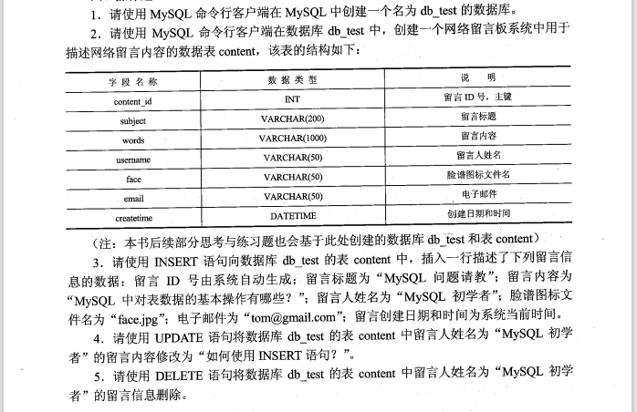

# 操作题&综合题

## 第 2 章 关系数据库

- pdf-71

1. 设有如表 2.25 所示的两个关系 R1 和 R2，其中 R2 是从 R1 中经过关系运算所形成的结果，请给出该运算表达式。

   - 

2. 设有如表 2.26 所示的关系 R3，请给出其全部函数依赖及候选关键字。

   - 

3. 设有如表 2.27 所示的关系 R4，请依次回答下面的问题。
   - 
   - i）关系是第几范式？  
     ii）是否存在操作异常？若存在，则将该关系分解为高一级范式。分解完成的高级范式中是否可以避免分解前关系中存在的操作异常？

## 第 3 章 数据库设计

- 

## 第 4 章 SQL 与关系数据库基本操作

- pdf-132 页

- 

1. 创建一个名为 db_test 的数据库

   - `CREATE DATABASE db_test`;

2. 创建一个数据表 content

   ```sql
     USE db_test;
     CREATE TABLE content(
       content_id INT NOT NULL AUTO_INCREMENT,
       subject VARCHAR(200),
       words VARCHAR(1000),
       username VARCHAR(50),
       face VARCHAR(50),
       email VARCHAR(50),
       createtime DATETIME,
       PRIMARY KEY(content_id)
     );
   ```

3. 插入数据：id 由系统自动生成；标题为"MySQL 问题请教"；内容为"MySQL 中对表数据的基本操作有哪些？"；姓名为"MySQL 初学者"；face 为"face.jpg"，email 为"tom@gmail.com"，创建时间为系统当前时间。

   ```sql
    INSERT INTO content VALUES (1, "MySQL 问题请教", "MySQL 中对表数据的基本操作有哪些？", "MySQL 初学者", "face.jpg", "tom@gmail.com", CURRENT_TIMESTAMP());
    INSERT INTO content VALUES (NULL, "MySQL 问题请教", "MySQL 中对表数据的基本操作有哪些？", "MySQL 初学者", "face.jpg", "tom@gmail.com", CURRENT_TIMESTAMP());
   ```

4. 使用 UPDATA 语句修改留言人姓名为"MySQL 初学者"的留言内容为"如何使用 INSERT 语句？"

   ```sql
    UPDATE table_name SET field1=new-value1, field2=new-value2 [WHERE Clause];
    UPDATE content SET words="如何使用 INSERT 语句？" WHERE username="MySQL 初学者" AND content_id=1;
   ```

5. 使用 DELETE 语句将表 content 中留言人姓名为“MySQL 初学者”的留言信息删除

   ```sql
     DELETE FROM table_name [WHERE Clause]
     DELETE FROM content WHERE username="MySQL 初学者" AND content_id=2;
   ```

## 第 5 章 数据库编程

- pdf-142

1. 在数据库 db_test 中创建一个存储过程，用于实现给定 content 表中一个留言人的姓名时，即可修改 content 表中该留言人的电子邮件为一个新的地址值。

## 第 6 章 数据库安全与保护

- pdf-169

1. 在数据库 db_test 的 content 表中创建一个触发器 content_delete_trigger,用于每次当删除 content 表中一行数据时，可将用户变量 str 的值设置为“old content deleted!”
2. 假定当前系统中不存在用户 wangming, 请设计一段 SQL 语句，要求创建这个新用户，并为其设置对应的系统登录口令“123”，同时授予该用户在数据库 db_test 的表 content 上拥有 select 和 update 的权限。
