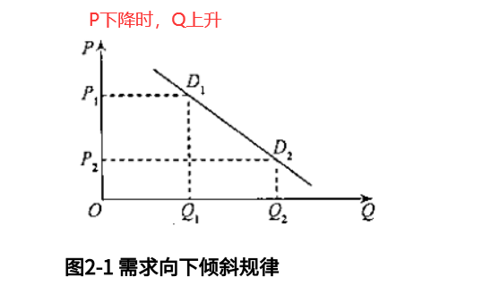
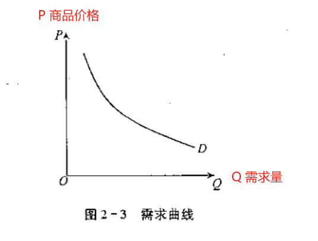
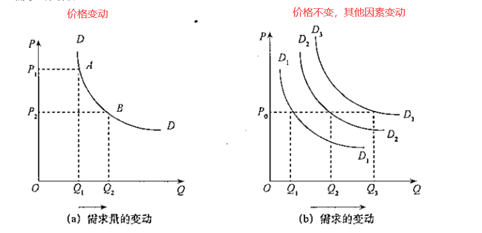
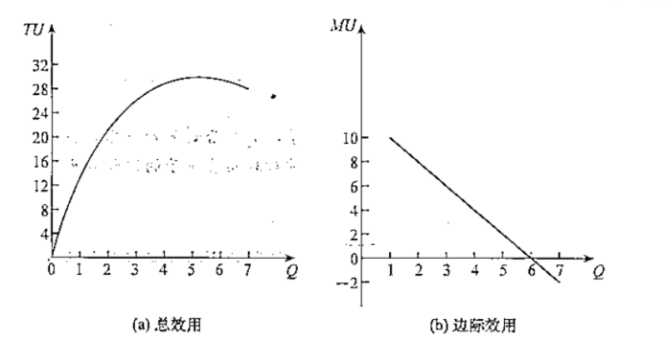

# 复习

## 第 1 章 导论

管理经济学是一门研究如何把传统经济学的理论和经济分析方法应用于企业管理决策实践的学科。

管理经济学的主要内容包括需求理论、生产理论、成本理论和市场利润。

`计算题`：会计利润与经济利润

## 第 2 章 供求分析

### 需求分析

1. 需求的概念
2. 影响需求的因素：

   1. 商品的价格。（需求向下倾斜规律）

      

   2. 消费者的收入水平。
   3. 相关商品的价格。（替代品和互补品）
   4. 消费者的偏好。

3. 需求函数 Qd = f(P, I, Pr, T...)

   

4. 需求量的变动和需求的变动

   

5. 求计与预测

   1. 需求估计方法

      市场调查方法; 统计分析方法;  
      回归分析（统计分析方法）步骤: 1）建立理论模型; 2）收集数据; 3）选择函数形式; 4）对结果的估计和解释;

   2. 需求预测方法

      时间序列; 调查和民意测验技术; 经济计量模型; 投入产出分析;

### 供给分析

影响供给的因素：

1. 商品的价格。（供给向上倾斜规律）
2. 生产成本。
3. 替代品的价格。
4. 生产者对价格的期望。

### 市场均衡：Qs = Qd

`计算题`：均衡价格与均衡产量

在商品 A 的市场中，有 10000 个相同的消费者，每个消费者的需求函数是 Qd=12-2P，同时又有 1000 个相同的生产者，每个生产者的供给函数是 Qs=20P。求市场的均衡价格和均衡产量。

市场需求曲线是：Qd=120000-20000P；
市场供给曲线是Qs=20000P
根据Qd=Qs，解方程得均衡价格Pe=3；均衡产量Qe=60000

## 第 3 章 消费者效用分析

1. 基数效用与序数效用
2. 总效用与边际效用

   总效用是指消费者在一定时期内从一定数量的商品消费中获得的效用量的总和。  
   边际效用是指消费者在一定时间内增加一单位商品的消费时，所获得的总效用的增量。  
   

3. 边际效用递减规律

   一般情况下，随着某一种商品或服务的消费数盘不断增加，它所带给消费者的效用增量是递减的，即消费者得到的边际效用最终会下降。这就是边际效用递减规律。

4. 消费者均衡

   效用最大化时的状态称为消费者的均衡状态。在这种状态下，消费者既不愿意增加购买，也不愿意减少购买。

   均衡条件: **MUx/Px = MUy/Py**

5. 消费者剩余

   消费者剩余(consumersurplus)就是消费者愿意为某一商品支付的价格与他在购买该商品时实际支付的价格之间的差额。

### 计算题

**均衡方程**

1.  已知某消费者用 5400 元购买 X 和 Y 两种商品，该消费者的效用函数是 U=2XY2，X 商品的价格是 20 元，Y 商品的价格是 30 元，为获得最大效用，该消费者应购买商品和 Y 商品各为多少？

    
5400=20X+30Y
  
    
MUX=2Y2，MUY=4XY

    
均衡方程是4XY/30=2Y2/20

    联立解方程得 X=90，Y=120。即为获得`最大效用`，该消费者购买的 X 商品和 Y 商品分别为 90 和 120 单位。

2.  
某人用400元的收入购买X、Y两种商品，PX=100元，PY=50元。

    写出该消费者的`预算线方程`。（2 分）

    该消费者的预算线方程是 400=100X+50Y。

    假设 X 价格降为 50 元，其他不变，写出消费者的预算线方程。（2 分）

    如果 X 价格降为 50 元，其他不变，消费者的预算线方程是 400=50X+50Y。

    假设收入降为 300 元，PX=PY=50 元，写出消费者的预算线方程。（2 分）

    
如果收入降为300元，PX=PY=50元，消费者的预算线方程是300=50X+50Y。
下·

## 第 4 章 需求价格弹性与供给弹性

1. 需求价格弹性

   需求价格弹性是指一种商品需求量变动对其价格变动的反应程度。
