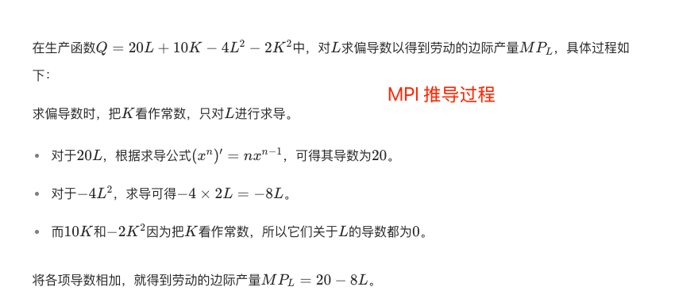

# 计算题

计算题（5 题/6 分，30 分）

## 第 1 章 导论

1. 原来工作年薪 10 万元的张三，辞职创办公司。一年过后，公司总业务收入 25 万元，支出的广告费 1 万元，保险费 0.5 万元，秘书薪水 3 万元，其他支出 0.7 万元。计算张三的会计利润和经济利润。（6 分）

## 第 2 章 供求分析

1. 假定某商品的需求曲线是 Qd ＝ 600-25P；供给曲线是 Qs ＝ -200 ＋ 15P。

   计算`均衡价格和均衡产量`。（3 分）

   如果供给曲线不变，由于消费者收入变化导致需求曲线变为 Qd ＝ 700-25P，计算新的均衡价格和均衡产量。（3 分）

2. 在商品 A 的市场中，有 10000 个相同的消费者，每个消费者的需求函数是 Qd=12-2P，同时又有 1000 个相同的生产者，每个生产者的供给函数是 Qs=20P。求市场的均衡价格和均衡产量。

3. 某产品的市场需求曲线为 Qd = 200 - 2P；供给曲线为 Qs = -40+2P。

   该产品的均衡价格和`均衡销售量`是多少？（3 分）

   如果该产品的最高政府限价为 30 元，此时会产生多大的`过度需求`（或过度供给）？（3 分）

## 第 3 章 消费者效用分析

1. 已知某消费者用 5400 元购买 X 和 Y 两种商品，该消费者的效用函数是 U=2XY2，X 商品的价格是 20 元，Y 商品的价格是 30 元，为获得最大效用，该消费者应购买商品和 Y 商品各为多少？

2. 某人用 400 元的收入购买 X、Y 两种商品，Px=100 元，Py=50 元。

   写出该消费者的预算线方程。（2 分）

   假设 X 价格降为 50 元，其他不变，写出消费者的预算线方程。（2 分）

   假设收入降为 300 元，Px=Py=50 元，写出消费者的预算线方程。（2 分）

## 第 4 章 需求弹性与供给弹性分析

1. 市场调查表明，目前我国市场上汽车的需求价格弹性为-1.2，需求收入弹性为 3，问：

   如汽车价格下降 3%，市场上的汽车销售量会出现什么变化？（3 分）

   如居民收入提高 2%，市场上的汽车销售量会出现什么变化？（3 分）

2. 某产品的需求曲线方程为 Q=30000-200P，该产品定价为 70 元。

   计算 P=70 元时的点价格弹性（结果保留两位小数）。（3 分）

   如果企业目标是增加销售收入，则应提价还是降价？为什么？（3 分）

3. 假设某企业的需求曲线方程为 Q=300-15P，分别计算 P=10 和 P=12 时的需求价格点弹性系数。

4. 某产品需求价格弹性在 1.2 ～ 1.8 之间。如果价格降低 8％，则预期销售量会增加多少？

5. 假设某企业需求曲线方程为 Q=200-10P，分别计算 P=5 和 P=10 时需求价格点弹性。（6 分）

6. 南方公司生产洗手液，现价 40 元，2017 年每月销售量为 10000 瓶。2018 年 1 月它的竞争对手北方公司把洗手液价格从每瓶 42 元降到 38 元。该年 2 月，南方公司的销售量减少到 8000 瓶。假设南方公司洗手液的弧价格弹性为-1，再假设北方公司把洗手液价格保持在 38 元，南方公司想把销售量恢复到每月 10000 瓶的水平，试问其洗手液的价格要降至多少？

7. 南方公司生产洗手液，现价为每瓶 40 元，目前的销售量为 8000 瓶。假设洗手液的弧价格弹性为-1，南方公司若想把销售量提高 10000 瓶，试问洗手液的价格要降至多少？

8. 若某种商品的需求方程为 Q=6000-30P，该商品的价格为 40 元。

## 第 5 章 生产要素投入的决策分析

1. 已知厂商的生产函数为Q=20L+10K-4L2-2K2，又设PL=4元，PK=2元，求成本为240时的最优生产要素组合。

   公式-最佳生产要素投入组合的均衡条件: MPl/Pl = MPk/Pk

   

   

2. 某玩具生产企业每天生产的玩具数量Q与投入的人工数量L之间的函数关系式为Q=124L-2L2。玩具的价格为每个20元，工人日工资为80元。那么，该企业为了获取最大利润，每天应雇佣多少工人？每天的玩具产量为多少？（6分）

   公式-变动生产要素最佳投入量的均衡条件为: VMPl = Pl

3. 已知厂商的生产函数为Q=10L+30K-2L2-6K2，其中，劳动L的价格PL=10，资本K的价格PK=30。计算当成本是80时，应投入L和K各多少才能使产量最大？最大产量是多少？（6分）

   公式-最佳生产要素投入组合的均衡条件: MPl/Pl = MPk/Pk

4. 已知某厂商生产函数为Q＝L3/7K4/7，假设劳动的价格PL＝3元，资本的价格PK＝4元。如果该厂商生产200单位产品，应使用多少单位的L和K才能使成本降至最低？此时成本是多少？

   公式-最佳生产要素投入组合的均衡条件: MPl/Pl = MPk/Pk

5. 某出租汽车公司现有小轿车100辆，大轿车15辆。每增加投入一辆小轿车，每月开支增加1250元，营业收入增加10000元；每增加投入一辆大轿车，每月开支增加2500元，营业收入增加30000元。试计算分析该公司大小轿车配合比例是否合理。
