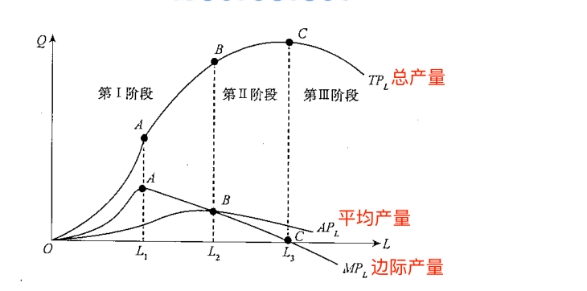

# 第 5 章 生产要素投入的决策分析

## 5.1 生产函数

1. 生产要素

    在管理经济学中，人们把生产要素分成四类：土地、劳动、资本、企业家才能。

2. 生产函数

    生产函数是指在一定时期内，在技术水平不变的情况下，生产中所使用的各种要素的数量与所能生产的最大产量之间的关系。

    生产过程中生产要素的投入量和产品的产出量之间的关系，可以用生产函数来表示。

    生产函数: Q=f(L; K; N; E). 该生产函数表示在既定的生产技术水平下生产要素组合(LKN，E)在每一时期所能生产的最大产量为Q。

    两种最常见的生产函数，即柯布一道格拉斯生产函数和学习曲线。

3. 柯布一道格拉斯生产函数
4. 学习曲线

    学习曲线是一种动态生产函数，或称生产改进函数。它以下面的假设为依据:知识对劳动的要素替代是生产经验的函数。

## 5.2 短期生产函数分析

1. 短期生产函数的概念

    短期生产函数是指企业在此期间内，只有一种投人要素的数量是可变的(如劳动力或原材料等)，其他投人要素的数量不变(如厂房、机器设备等)。

    现假定企业生产过程中，劳动投人量是可变的，用 L表示，资本投人量是固定的，用K表示，则短期生产函数可以表示为: Q=f(LK)

    变动要素投入量 L

    总产量 TPl

    平均产量 APl

    边际产量 MPl

    MPl = 0 时, TPl达到最高; MPl > APl时, 平均产量上升;

    边际产品价值 VMP 是指每增加一个单位某种可变生产要素所增加的收入。

    生产要素边际成本 MFC

    边际技术替代率 MRTS

2. 边际收益递减规律

3. 生产三阶段

    

    第I阶段，可变要素投人从零开始，到平均产量最大值L为止。

    第Ⅱ阶段，可变要素投人从平均产量最大值的L开始，到边际产量为0的 Ls止。

    第Ⅲ阶段，可变要素投人从边际产量为0的L以后的段。这一阶段的特点是可变要索投人的平均产量继续递减。

## 5.3 长期生产函数分析

1. 概念

    在长期内，企业可以调整全部的生产要素的数量，在这种情况下，分析投人要素与产量之间的关系，即为长期生产函数分析。

    为了研究生产要素的最佳组合，需要运用等量曲线和等成本线。

2. 等产量曲线

    等产量曲线是用来表示在技术水平不变的条件下，生产同一产量的两种生产要素投人量的各种不同组合的轨迹。

    等产量曲线的特点：  
    - 是一条向右下方倾斜的曲线。
    - 在同一平面上，可以有无数条等产量曲线。
    - 在同一平面上，任意两条等产量曲线不能相交。
    - 等产量曲线的形状反映出两种要素的替代性。
    - 等产量曲线是一条凸向原点的曲线。

        这是由边际技术替代率递减所决定的。所谓边际技术替代率(marginal rate of techni-cal substitution，MRTS)，是指为了维持相同产量水平，增加一种生产要素的数量与可以减少的另一种生产要素的数量之比。

3. 等成本线

    等成本线是一条表明成本与生产要素价格既定的条件下，可以购买到的两种生产要素数量的最大组合的线。

4. 生产要素的最佳组合

    产量既定成本最小的要素组合

    成本既定产量最大的要素组合

    最佳组合的均衡条件： MPl/Pl = MPk/Pk

## 5.4 规模报酬

1. 概念

    所谓规模报酬，是指在一定的技术条件下，所有生产要素的投入都按同一比例变化，从而生产规模变动时所引起的产量或收益的变动。

    1）规模报酬发生作用的前提是技术水平不变。
    2）规模报酬发生作用的条件是所有生产要素的投入都按同一比例变化。

2. 规模报酬变动的原因

## 5.5 生产函数与技术进步

1. 技术进步导致生产函数的改变
2. 技术进步的测定
