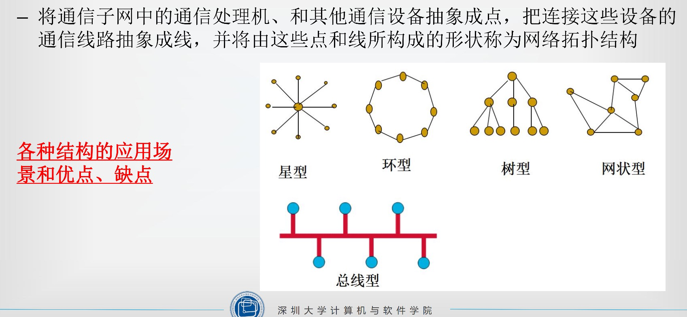
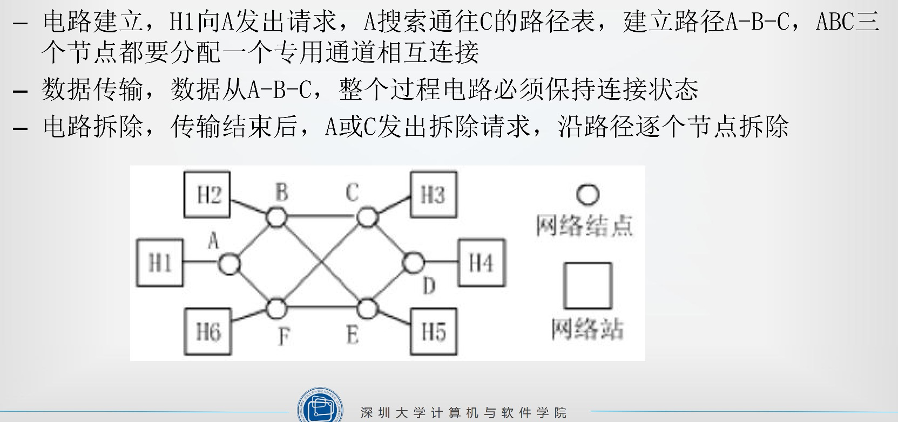
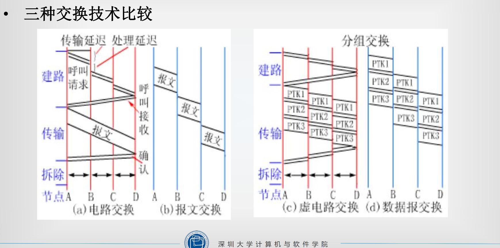
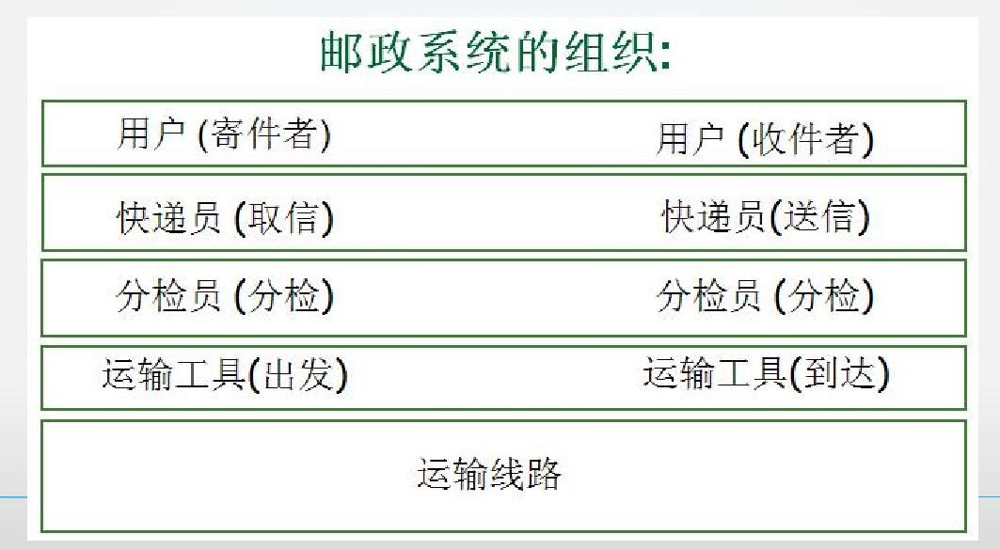
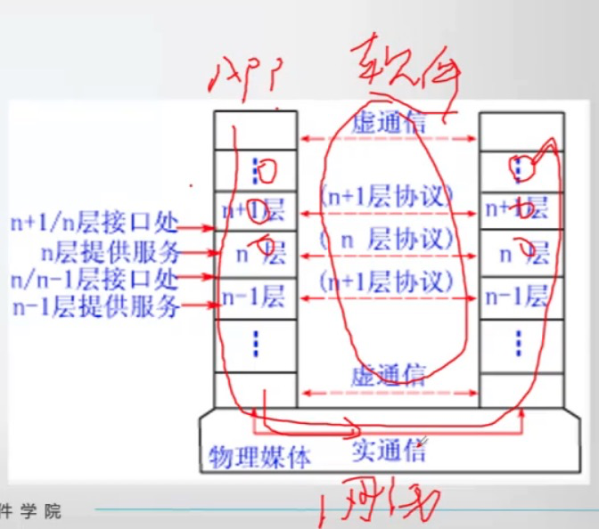
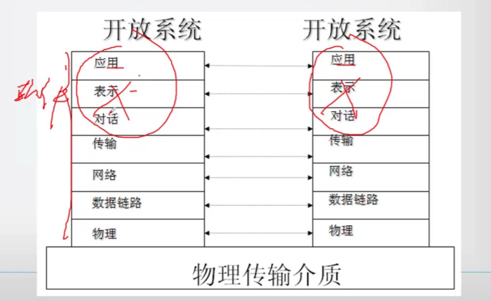
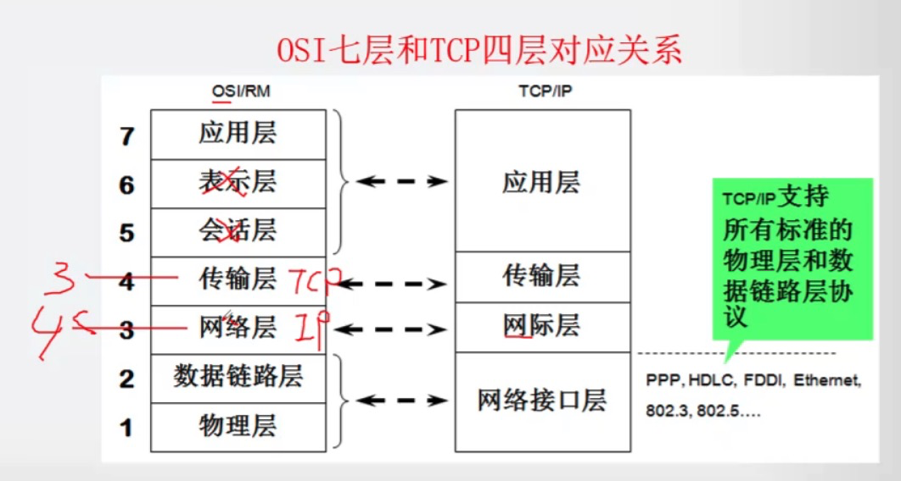
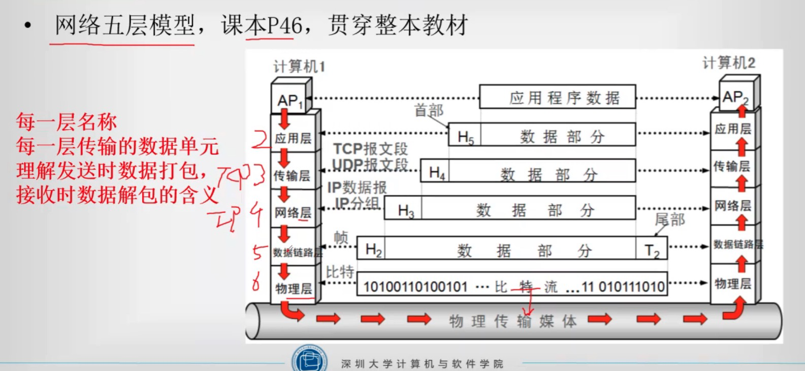

[课程讲师：白鉴聪](https://csse.szu.edu.cn/pages/user/index?id=1214)

**章节概述及考试题型**

- 《计算机网络原理》是计算机专业的核心必修课程，课程于2018年开始启用新教材，自2018年10月起的试卷对应新教材。
- 课程包含8章，组织为：1+5+2
  - 第1章是概述
  - 第2—6章是对应网络体系结构五层模型
  - 第7章是移动网络，对应当前热点
  - 第8章是网络安全，传统的基础知识
- 重难点顺序：1、3、4 -> 2、5、6 -> 7、8
- 考试题型
  - 单选，25分，1 * 25
  - 填空，10分，1 * 10
  - 简答，30分，5 * 6
  - 综合，35分，10 + 12 + 13 -- 3小题
- 考试重点划分：教材第4 -13页，每章重点难点占分值60%以上

#### 第一章网络概述

#### 1.1 基本概念

1. 计算机网络的定义

   计算机网络是互连的、自治的计算机的集合。

2. Internet/因特网

   - 目前最大的、应用最广泛的计算机网络就是Internet。是由很多网络互连而构成的全球性网络。
   - ISP(Internet Service Provider)  Internet服务提供商
   - 本地ISP、区域ISP、国家级ISP
   - ISP网络由分组交换设备构成
   - 分组交换设备：路由器、交换机

3. 协议

   - 网络协议定义：计算机网络中的实体在进行数据交换的过程中遵循的规则或约定
   - 协议三要素：语法、语义、时序
     - 语法：数据与控制信息的结构或格式。
     - 语义：定义实体之间交换的信息中需要发送哪些控制信息，完成何种动作以及做出何种响应。
     - 时序：事件实现顺序的详细说明。
   - 网络协议的产生
     - 计算机网路中的数据交换必须遵循事先约定好的规则
     - 这些规则明确规定了所交换的数据的格式以及有关的同步问题（同步含有时序的意思）
     - 网络协议必须考虑如何对付各种异常情况的出现

4. 计算机网络功能：资源共享（硬件资源共享、软件资源共享、信息资源共享）

5. 计算机网络的分类

   - 按覆盖范围分类：（个域网、局域网、城域网、广域网）

   - 按拓扑结构分类：（星型、总线型、环形、网状、树形、混合型）

     网络拓扑是指网络中的主机、网络设备间的物理连接关系与布局。

     

   - 按交换方式分类（电路交换、报文交换、分组交换）

   - 按用户属性分类

     - 公用网：国家或企业出资，公共基础设施，例如电信、城市热点
     - 私有网：军事、铁路等专用网

#### 1.2 网络结构

1. 网络边缘：普通网络用户、网站
2. 接入网络
   - 电话拨号接入
   - ADSL
   - HFC接入
   - 局域网
   - 移动接入
3. 网络核心
   - ISP
   - 实现网上传输数据的中继与转发，即数据交换

#### 1.3 数据交换技术

###### 数据交换的概念

- 数据交换设备
- 交换节点、通信子网

###### 数据交换三种技术

1. 电路交换

   - 在电路交换网络中，首先需要通过中间交换结点为两台主机之间建立一条专用的通信线路，称为电路，然后再利用该电路通信，通信结束后再拆除电路。

   - 过程：电路建立、传输数据、拆除电路

   - 特点：电路交换是有连接的，在通信时需要先建立电路连接，在通信过程中独占一个信道，通信结束后拆除电路连接。

   - 电路交换举例：H1和H3通信

     

2. 报文交换

   - 数据传输单位是报文，报文就是站点一次性要发送的数据块
     - 报文长度补点，可变长
   - 报文交换特点
     - 以报文为单位进行交换
     - 不需要再两个站之间建立专用通路
     - 传送方式采用’存储—转发‘交换方式
   - 报文交换举例：H1和H3通信
     - H1要把H3地址附在报文中，然后发给A
     - A节点存储报文，并找下一个节点转发
     - 经过多个节点存储-转发，最终到达H3

3. 分组交换

   - 分组交换：将一个报文分成若干个分组，逐个发送分组。
     - 分组长度有一个上限，典型的最大长度是数千字节。
   - 特点
     - 分组交换是目前计算机网络广泛采用的技术
     - 在发送端，先把较长的报文划分成短的、固定长度的数据段。
     - 分组交换的优点（可出简答题）
       - 交换设备存储容量要求低
       - 交换速度快
       - 可靠传输效率高
       - 更加公平
   - 分组交换举例：H1和H3通信
     - H1把报文分割为n个分组，每个分组都包含H3地址，把分组逐个发给A
     - A节点每接收完一个分组，就找下一个节点转发
     - 经过多个节点存储—转发，最终到达H3

#### 1.4 网络性能

1. 数率
   - 速率基本单位bit/s（比特每秒）
   - 进制转换：K/M/G/T         
   - 时间单位：毫秒ms、秒s
   - 比特bit和字节Byte的关系，1Byte=8bit
2. 带宽，有两重含义
3. **网络时延（本章重点+难点）**
   - 处理时延
   - 排队时延
   - 传输时延 dt = L / R，L是传输总量，R是链路带宽
   - 传播时延 dp = D / V，D是传播距离，V是传播速度
   - 时延带宽积，G = dp * R，单位bit
   - 丢包率
   - 吞吐量

#### 1.5 体系结构

1. 计算机网络的复杂性、异质性

   - 不同的通信介质——有线、无线、...
   - 不同种类的设备——主机、路由器、交换机...
   - 不同的操作系统——Unix、Windows、...

2. 物流系统的分层解决思想

   - 每层实现一种特定的服务，向上提供服务

   - 自己内部的功能实现独立，不受影响

   - 可以使用下层提供的服务

     

3. 计算机网络采用分层设计、对等通信、虚通信原则

   - 对等实体之间实现的是虚拟的逻辑通信
   - 下层向上层提供服务
   - 上层依赖下层提供的服务来与其它主机上的对等层通信
   - 实际通信在最底层完成

   

4. OSI参考模型，简称OSI/RM，是由国际标准化组织（ISO）制定的标准化开发式计算机网络层次结构模型

   

5. **OSI七层模型**

   - 1、物理层，在物理线路上传输原始的二进制数据
   - 2、数据链路层，在有差错的物理线路上提供无差错的数据传输
   - 3、网络层，控制通信子网提供源点到目的点的数据传送
   - 4、运输层，为用户提供端到端的数据传送服务
   - 5、会话层，为用户提供会话控制服务
   - 6、表示层，为用户提供数据转换和表示服务
   - 7、应用层，为用户提供网络应用服务

6. TCP/IP参考模型

   - 传输控制协议TCP/IP是目前最常用到的一种通信协议，它是计算机世界里的一个通用协议。
   - TCP/IP 的四层网络体系结构已成主流
   - 在局域网中，TCP/IP最早出现在Unix系统中，现在几乎所有的厂商和操作系统都开始支持它。

7. TCP/IP四层模型

   - 应用层
   - 传输层
   - 网络互连层
   - 网络接口层

   

8. 网络五层模型

   

#### 1.6 发展历史

