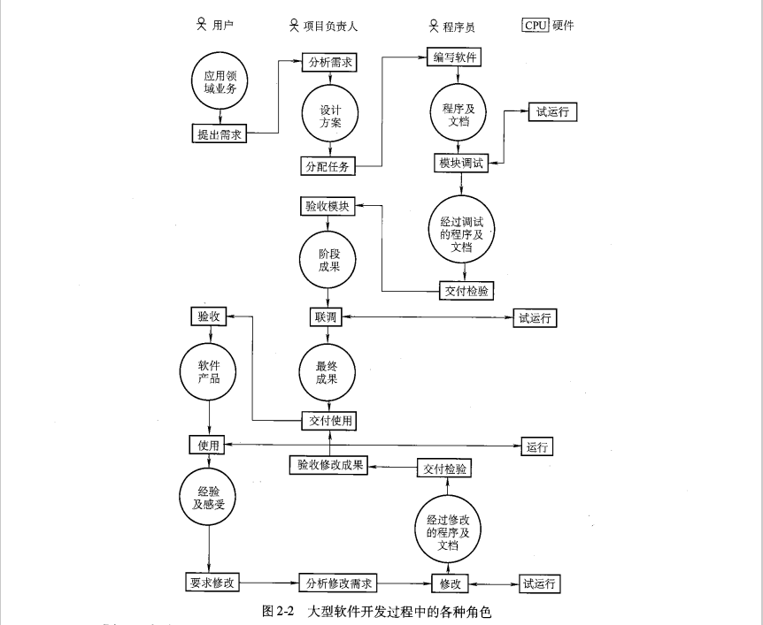

## 2.1 软件开发的困难

1. 软件开发的基本问题

   - 两个转换：1.首先是`从用户的理解到程序员的理解`；2.其次是`从程序员的理解到程序的实现`。
   - 从用户的理解到程序员的理解
     - 保证这一转换顺利完成的手段就是利用尽可能标准化的方法`编写程序设计任务书`
   - 从程序员的理解到程序的实现
     - 这一转换所要解决的是`人和机器之间的交流与协调`问题，做好第二个转换的关键在于`程序员的知识水平与实际经验`。

2. 大型软件开发中的困难

   - （1）一致性难以保持；  
     （2）测试的困难大为增加；
     （3）工作进度难以控制；
     （4）文件与代码难以协调；
     （5）版本更新困难。

3. 困难产生的原因

   - （1）大系统的复杂性；
     （2）个人之间的组织与协调带来大量的困难
     （3）各个领域之间的差别导致困难的加重
     （4）时间的因素，变化的因素给软件开发工作带来许多困难

## 2.2 软件开发方法的发展

- 各种不同的人员在软件开发工作中承担的责任
  - 
  - 用户，承担的工作为四项：提出需求、验收、使用、要求修改。
  - 项目负责人（或软件架构师）：分析需求，向程序员分配任务，验收程序员的工作成果，对整个软件进行联调，向用户交付使用，接收与分析用户的修改要求，向程序员布置修改任务，验收修改成果并向用户提交新的版本或修改的结果。
  - 程序员，任务比较明确，即编写程序，编写文档，调试自己编码的程序，向项目负责人提交工作成果。
  - 在大型软件开发过程中，`程序员`承担模块调试工作。作为`用户`，承担的工作有提出需求、验收、使用、要求修改。任务比较复杂的是`项目负责人`（或软件架构师），承担着分析需求、分配任务、验收代码有文档、联调、交付等。

1. 结构化程序设计方法

   - 结构化程序设计的思想是在` 20 世纪 60 年代末期`产生的。结构化程序设计方法主要是为程序员服务的。
   - 基本思想：把程序的结构分解成`三种基本模块`：处理单元、循环机制、二分决策机制。
   - 模块划分的三条基本要求
     - 1）逻辑尽可能单一；2）模块之间的联系尽可能少；3）模块的规模应当足够小
   - 结构化程序设计采取自顶向下的方法，分成若干部分，并把它们之间的关系明确表达出来。

2. 软件工程方法

   - 软件工程思想的产生

     - 软件危机的发生；`程序员的技能与认真负责是不牢靠的`；从根本上，要想大幅度地提高软件开发的效率和质量，应吸取人们的成功经验，从组织和管理的角度加强力量；`使软件生产从程序员的个人劳动提高成为可控制的工程，这就产生了软件工程`。
     - 软件工程的思想出发点：从软件开发的经验中归纳出工作步骤和交流标准，大家都遵守和执行它们，那么软件开发的进度与质量就可以得到保证。
     - 软件工具的思想与方法在` 20 世纪 80 年代`中得到了广泛的宣传
     - 软件工具的思想与方法在 20 世纪 80 年代中得到了广泛的宣传，对于软件开发工作的改进发挥了一定的作用。软件工程的思想主要集中于加强`项目管理者`的工作上。

   - 应用软件开发过程的划分和规定

     - 第一阶段，需求分析
     - 第二阶段，分析与设计阶段
     - 第三阶段，编程阶段
     - 第四阶段，测试阶段
     - 第五阶段，使用及维护阶段

   - 在标准化方面：一方面是表达方式的标准化；另一方面是对工作的质量及检查制定标准。

3. 面向对象的程序设计方法

   - 基本思想
     - 1）客观世界的任何事物都是对象，它们都有`静态属性`，也都有相关的操作
     - 2）对象之间有抽象与具体，群体与个体，整体与部分等几种关系
     - 3）抽象的、较大的对象所具有的性质，自然地成为它的子类的性质
     - 4）对象之间可以互送消息。这消息可以是传送一个`参数`，也可以是使这个对象开始某个操作。
   - 把信息的静态属性：数据结构和对它的处理：功能模块结合起来的想法属于面向对象程序设计方法。
   - 面向对象的程序设计语言反映的趋向。它摒弃了“自顶向下”和“自底向上”的争论，`合理地选择层次，使得系统的复杂性保持在可控制的范围内`，而不致由于细节过多而无所适从。
   - 面向对象程序设计方法产生了巨大的影响，根本原因在于它提供了`认识框架`。面向对象的程序设计将认识框架迅速地散布到程序设计语言的范围之外，以至出现了面向对象的`系统分析`，面向对象的`系统设计`，面向对象的`数据库管理系统`等。

4. 即插即用的程序设计方法

   - 基本思想： `一部分人专门开发软件组件， 另一个人构造整个软件的结构，并且把组件插入这个结构`，以便快速完成开发工作。
   - 即插即用程序设计方法是基于面向对象的程序设计方法提出来的。

5. 面向开源软件的程序设计方法

   - 开源软件的使用起决定作用的两个方面因素
     - 一方面使对于`应用领域`的充分了解，这是我们判断能否利用某开源软件的主要依据；
     - 另一方面是`开源软件的质量`，包括其文档和代码的规范程度

- **真题**
  - 在软件开发过程中，由项目负责人承担的工作是`模块验收`
  - 在模块结构图中，如果模块右上角有星号（\*），则该星号表示（`循环调用`）
  - 关于结构化程序设计原则的说法中，错误的是（`模块间尽量采用逻辑耦合` ）
  - 大型软件开发过程中起着十分关键作用的角色是（`项目负责人` ）
  - 软件工程方法得到广泛的`宣传`，是在 20 世纪（`80年代` ）
  - 关于什么是好的软件，下述看法不准确的是（`速度越快越好` ）
  - 为了克服软件危机，人们先后提出了多种程序设计方法，最早提出的是（`结构化方法` ）
  - 评价一款软件的优劣，下列说法中最重要的是（`正确地实现功能` ）
  - 结构化程序设计方法的主要服务对象是（`程序员` ）
  - 从软件开发方法发展的角度，把信息的静态属性和对它的处理结合起来的想法，最早出现于（`面向对象程序设计方法` ）
  - 结构化程序设计的实施方法是（`自顶向下` ）
  - 在大型软件开发中，提出系统修改要求的是（ `用户`）
  - 即插即用程序设计方法的基础是（`面向对象方法` ）
  - 在大型软件开发中，承担模块试运行的是（`计算机` ）。在大型软件开发中，承担模块试运行的是 CPU 硬件，也就是计算机了。
  - 实施面向对象的程序设计，采用的方法是（`合理选择层次，控制系统复杂性` ）
  - 判断能否利用某开源软件的主要依据是（`对应用领域的充分了解` ）
    - 使用开源软件起决定作用的两个因素：
      （1）对应用领域的充分了解是我们判断能否利用某开源软件的主要依据。
      （2）开源软件的质量，包括其文档和代码的规范程度。
  - 对象具有一些静态属性和相关操作，但不对外公开这些属性与操作的性质称为**封装性**
  - 几十年来，为了提高程序设计水平，人们先后提出了`结构化`程序设计、软件工程方法、面向对象程序设计、即插即用程序设计等多种方法。
  - 在面向对象的程序设计中，较大的对象所具有的性质，自然地成为其子类的性质不必加以说明或规定，这就是`继承`性
  - 结构化程序设计方法把程序结构分解成三种基本模块：`处理单元`、`循环机制`、`二分决策机制`。
  - 卡内基·梅隆大学的软件工程研究所提出`能力成熟度 | CMM`模型，作为衡量软件开发项目组的标准。
  - 在结构化程序设计中，子程序尽可能做到只有一个入口和`一`个出口
  - 在大型软件开发过程中，用户承担的工作包括：`提出需求`、验收、使用、要求修改。
  - 面向对象程序设计方法产生了巨大的影响，根本原因在于它提供了`认识框架`
  - 客观世界的任何事物都是对象（Object），它们都有一些`静态属性`和相关的操作
  - 作为一个整体，对象对外不必公开属性与操作，这就是`封装`性
  - 模块之间的联系及互相影响称为耦合。一般来说，应当尽量避免**逻辑耦合**，而仅限于**数据耦合**

## 2.3 软件开发过程的管理

1. 什么样的软件才是好的软件？

   - 1）正确地实现所要求的功能，准确地给出预定的输出结果
   - 2）用户界面友好，符合实际用户的使用习惯与知识能力
   - 3）具有足够的速度，能在符合用户要求的时间限度内，给出所要求的处理结果
   - 4）具有足够的可靠性，能够在各种干扰下保持正常的工作
   - 5）程序易读，结构良好，文档齐全，从而保证系统易于修改

2. 好的程序员与好的项目组

   - 就单个程序员而言：  
     （1）具备程序设计所需的基本知识和技能。
     （2）对项目所在的领域有较深入的了解。
     （3）熟悉软件开发的技术环境。
     作为项目组的成员，还必须使自己的工作融入整个系统，严格遵守：
     （1）仅在本模块内操作。
     （2）按总体设计的要求传递参数。
     （3）按统一规定的格式操作数据库或公用文件
     （4）按统一的原则使用标识符。
     （5）按统一的要求编写文档。
     （6）保持程序风格一致。

3. 怎样建立一个好的项目组？

   - 1）有严格、成文的工作规范和文档标准
   - 2）人员之间有严格的分工
   - 3）每个项目都要事先制定详细的时间表，并且得到严格执行

- **真题**
  - —个优秀的程序员要成为项目组的好成员，必须（`按统一规定的格式操作公用文件或数据库` ）
    - 作为整个项目组的一员，除了把自己分担的部分功能实现之外，更重要的是要使自己的工作融入整个系统，与其他部分协调一致地工作。以下几点是必须严格遵循的。
      （1）保证严格地在本模块范围内操作，决不使用可能干扰其他模块的命令或函数。
      （2）格按总体设计的要求和理解去传递参数值，绝不要随意修改其内容或含义；
      （3）在对公用的文件或数据库进行存取时，必须完全地、准确地按统一规定的格式去操作，决不能擅自改变；
      （4）在使用标识符时，应按照统一的原则，尽量使用易于看出逻辑含义的名称。特别是涉及公用数据及参数的时候；
      （5）严格按照统一的要求编写文档，在内容、格式、表达方式、符号使用上遵循项目组的统一规定；
      （6）尽量保持程序风格的一致。总之，`作为项目组成员`，必须具有高度的组织纪律性和团队精神。其余三个选项是就`单个优秀程序员的指标`。
  - 一个优秀的程序员要成为项目组的好成员，必须（`具有高度组织纪律性和团队精神` ）
  - 对于软件开发来说，`项目管理的核心`要素是软件的**质量 | 质量问题**
  - 作为开发大型软件项目组成员，必须具有高度的组织纪律性和**团队精神**

## 复习题

1. 作为一个程序员，软件开发的主要困难是什么？

   - 1.首先是从用户的理解到程序员的理解；2.其次是从程序员的理解到程序的实现。

2. 对于程序员来说，提高软件开发的质量与效率应当从哪些方面努力？

   - 1.尽可能地了解与熟悉应用领域，并且正确地理解用户工作中的信息需求和信息流程。
   - 2.提示知识水平与实际经验，理解机器语言的思维方式、工作方式。

3. 大型软件的开发与单个程序员编写软件有什么本质区别？

   - 单个程序员面临的困难：1.首先是从用户的理解到程序员的理解；2.其次是从程序员的理解到程序的实现。
   - 大型软件开发面临的困难：
     - （1）一致性难以保持；  
       （2）测试的困难大为增加；
       （3）工作进度难以控制；
       （4）文件与代码难以协调；
       （5）版本更新困难。

4. 几十年来，人们为了提高软件开发的质量与效率提出了哪些方法？

   - 结构化程序设计
   - 软件工程
   - 面向对象的程序设计方法
   - 即插即用的程序设计方法
   - 面向开源软件

5. 结构化程序设计的基本思想与方法是什么？

   - 把程序的结构分解成三种基本模块：处理单元、循环机制、二分决策机制。

6. 软件工程的基本思想与方法是什么？

   - 从软件开发的经营中归纳出工作步骤和交流标准，大家都遵守和执行它们。

7. 面向对象的程序设计的基本思想是什么？

   - 基本思想
     - 1）客观世界的任何事物都是对象，它们都有静态属性，也都有相关的操作
     - 2）对象之间有抽象与具体，群体与个体，整体与部分等几种关系
     - 3）抽象的、较大的对象所具有的性质，自然地成为它的子类的性质
     - 4）对象之间可以互送消息。这消息可以是传送一个参数，也可以是使这个对象开始某个操作。

8. 即插即用的程序设计的基本思想是什么？

   - 一部分人专门开发软件组件，另一部分人构造整个软件的结构，并且把组件插入整个结构，以便快速完成开发工作。

9. 面向开源软件的程序设计的基本思想是什么？

   - 在什么情况下利用开源软件进行程序设计比较合适
     - 在一些应用面广，流程比较清晰、比较规范的应用领域，开源代码的重用 是比较有把握的。
     - 例如，网站的设计确实可以从开源代码中找到比较实用的，略加修改就可 以使用的代码。这无疑是可以节省人力和物力的。
   - 判断能否利用某开源软件的主要依据是对应用领域的充分了解

10. 具有哪些特点才称得上是一个好的软件？

    - 正确地实现所要求的功能，准确地给出预定的输出结果
    - 用户界面友好，符合实际用户的使用习惯与知识能力
    - 具有足够的速度，能在符合用户要求的时间限度内，给出所要求的处理结果
    - 具有足够的可靠性，能够在各种干扰下保持正常的工作
    - 程序易读，结构良好，文档齐全，从而保证系统易于修改

11. 一个好的项目组应当具备哪些基本条件？

    - 有严格、成文的工作规范和文档标准
    - 人员之间有严格的分工
    - 每个项目都要事先制定详细的时间表，并且得到严格执行

## 百日题库-主观题

1. 【2015 年 4 月】简述`软件工程思想`的产生。

   - 软件危机的发生；程序员的技能与认真负责是不牢靠的；从根本上，要想大幅度地提高软件开发的效率和质量，应吸取人们的成功经验，从组织和管理的角度加强力量；使软件生产从程序员的个人劳动提高成为可控制的工程，这就产生了软件工程。

2. 【2015 年 4 月】简述软件工程从传统产业工程方法中吸取的成功经验。

   - 对软件工程工作的步骤做出了严格的规定；工作顺序不能颠倒；每一个阶段都有各自的明确的任务；在质量、表达方式等方面要有统一的，并为人们共同遵守的标准；利用有关各方沟通与交流的手段，使参加工作的人们成为一个整体，共同地完成一项大的工程任务。

3. 【2015 年 10 月】简述可以单独地承担软件开发任务的程序员应具备的条件。

   - （1）具有程序设计所需要的基本知识与技能；  
     （2）对本项目所在的领域有较深入的了解，能够准确地理解用户的信息需求；  
     （3）对于软件开发的技术环境比较熟悉，有实际运用的经验。

4. 【2016 年 4 月】简述即插即用的程序设计的基本思想。

   - 应用硬件制造思路来处理大型软件开发工作的方法。一部分人专门生产软件组件。而另一部人则构造整个软件的结构，并且把软件组件插入结构中。

5. 【2016 年 4 月】在什么情况下利用开源软件进行程序设计比较合适？举例说明。

   - 在一些应用面广，流程比较清晰、比较规范的应用领域。

6. 【2016 年 10 月】真正实现即插即用的程序设计，为什么不是那么简单？

   - （1）标准化；  
     （2）软件部件缺乏统一的标准；  
     （3）对于各种对象的定义，难以定出标准；  
     （4）软件部件的提供方式存在问题；  
     （5）硬件及操作系统的关系问题。

7. 【2017 年 10 月】大型软件开发有哪些困难？

   - （1）一致性难以保持。  
     （2）测试的困难。  
     （3）工作进度难以控制。  
     （4）文档与代码难以协调。  
     （5）版本更新带来困难。

8. 【2017 年 10 月】为了提高软件开发质量，程序员应当从哪些方面努力？

   - 就单个程序员而言：  
     （1）具备程序设计所需的基本知识和技能。
     （2）对项目所在的领域有较深入的了解。
     （3）熟悉软件开发的技术环境。
     作为项目组的成员，还必须使自己的工作融入整个系统，严格遵守：
     （1）仅在本模块内操作。
     （2）按总体设计的要求传递参数。
     （3）按统一规定的格式操作数据库或公用文件
     （4）按统一的原则使用标识符。
     （5）按统一的要求编写文档。
     （6）保持程序风格一致。

9. 【2018 年 4 月】好的软件应具备哪些条件？

   - （1）正确地实现所追求的功能，准确地给出预定的输出结果。  
     （2）用户界面友好，符合实际户的使用习惯与知识能力。
     （3）具有足够的速度（而不是越快越好），能在符合用户要求的时间限度内，给出所要求的处理结果。
     （4）具有足够的可靠性，能够在各种干扰下保持正常的工作。
     （5）程序易读，结构良好，文档齐全，从而保证系统易于修改。

10. 【2018 年 4 月】简述模块的划分应当符合的基本要求。

    - （1）模块的功能在逻辑上尽可能地单一化、明确化，最好做到一一对应。  
      （2）模块之间的联系及互相影响尽可能地少，对于必需的联系都应当加以明确的说明，如参数的传递、其文件的内容与格式等。
      （3）模块的规模应当足够小，以便使它本身的调试易于进行。

11. 【2018 年 10 月】大型软件开发有哪些困难？

    - （1）一致性难以保持；  
      （2）测试的困难大为增加；
      （3）工作进度难以控制；
      （4）文件与代码难以协调；
      （5）版本更新困难。

12. 【2019 年 4 月】简述即插即用程序设计的基本思想。

    - 一部分人专门开发软件组件， 另一个人构造整个软件的结构，并且把组件插入这个结构，以便快速完成开发工作。
