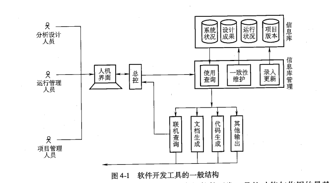

## 4.1 基本功能与一般结构

1. 软件开发工具的基本功能

   - 1）提供描述`软件状况`及其`开发过程`的`概念模式`；（系统描述）
     - 软件开发工具是引导人们建立正确的、有效的概念模式的一种手段。
   - 2）提供存储和管理有关信息的`机制`与`手段`；
   - 3）帮助使用者编制、生成及修改各种`文档`；（生成文档）
   - 4）帮助使用者编写`程序代码`；（生成代码）
   - 5）对于历史信息进行跨生命周期的管理，把`项目进度`与`版本更新`的有关信息科学地管理起来。

2. 软件开发工具的一般结构
   - 总控和人机界面
   - 信息库及其管理
   - 代码生成与文档生成
   - 项目管理与版本管理
   - 

- **真题**
  - 1. 在软件开发工具的一般结构中，不属于信息库管理的是（`文档生成`）
  - 2. 下述关于软件开发工具作用的说法中，错误的是`完全被动地为用户服务`
  - 3. 从软件开发工具的一般结构来看，`总控和人机界面`是使用者和软件开发工具之间交流信息、实现所有支持功能的桥梁。
  - 4. 一个好的开发软件工具不仅能帮助使用者完成具体的开发任务，而且能引导使用者熟悉和掌握科学的开发方法，即形成正确的`概念`模式。
  - 5. 软件开发工具提供存储和管理有关软件信息的`机制`和手段。

## 4.2 总控与人机界面

- 作为一个完整的、一体化的软件开发工具，`总控`和`人机界面`处于中心的位置。为了有效地支持软件开发人员的工作，软件开发工具必须提供各工作环节之间的协调与配合。

- 软件配置或集成问题
   - 例如，十分常见的情况是，在分析阶段使用某种独立于机器的、一般化的、以逻辑设计文档作为其最终输出的某种工具；而在设计编码阶段，使用另一种依赖于某个软件的设计工具，它要求某种特定的输入，并由此生成特定语言的源程序。
   - 在这种情况下，最关键的也是最麻烦的就是把前半段工作的输出（即逻辑设计方案），准确无误地转化为后半段工作所要求的输入。这个问题是十几年来许多公司与研究单位集中力量加以研究的课题，即所谓的软件配置或集成的问题。

- 软件开发过程的五个阶段（AD/Cycle）
   - 需求分析阶段；
      - 需求分析阶段的任务是`建立逻辑模型`。首先建立起软件所`处领域或环境的模型`。其次，建立软件所要处理的`信息的静态模型`，即数据模型。第三，建立`信息流通的模型`，即信息的来源、去向、存储及处理的逻辑过程。
   - 分析设计阶段；
      - 分析阶段的任务包括建立信息的`流通模型`，即信息的来源、去向、存储处理的逻辑过程
      - 分析设计阶段的基本任务是完成系统的总体设计，这包括数据结构的详细设计、处理过程的详细设计、子系统或模块的划分以及它们之间相互联系的具体规定。
   - 编码阶段；
   - 测试阶段；
      - 测试阶段的任务是对已经完成的各个`模块或子系统`进行测试、调整，以便最终形成完整的软件。维护阶段的任务是组织管理软件的日常运行，收集运行中的状态信息及出现的问题，并且及时地进行局部的修改与完善。
   - 维护阶段

- 软件开发工具在技术考虑上的三要点
   - 1. 面向使用者
      - 面向用户的原则具体体现在两个方面，一方面是总控对各部分的调度与安排应当符合上述模式，另一方面是向用户提供的统一界面应当体现这个模式。
      - 对于软件开发工具来说，所谓面向用户，最根本的是要立足于符合实际的应用领域，符合软件开发人员思路的概念模型，包括静态模型（如SAA）和动态模型（AD/Cycle）。
   - 2. 保证信息的准确传递
   - 3. 保证系统的开发性或灵活性

- **真题**
  - 1. 软件开发工具的各技术要素中，处于中心位置的是`总控和人机界面`
  - 2. 根据 IM 的 AD/Cycle 模型，不属于需求分析阶段任务的是`划分子系统成模块`
  - 3. 在 AD/Cycle 模型中，建立信息的流通模型属于（`需求分析工作` ）
  - 4. 在IBM的AD/Cycle框架中，需求分析阶段的任务是建立`逻辑`模型
  - 5. 按照AD/Cycle的阶段划分，如果一个软件开发项目正在划分模块并规定模块之间的相互联系，那么这个项目正处于`分析`阶段
  - 6. AD/Cycle将软件开发过程的每一个周期分为五个阶段，它们分别是：需求分析阶段、`分析设计`阶段、编码阶段、测试阶段、`维护`阶段。
  - 7. 按照AD/Cyde的阶段划分，分析阶段的任务包括建立信息的`流通`模型，即信息的来源、去向、存储处理的逻辑过程。
  - 8. 总控和人机界面处于软件开发工具的中心位置，这主要出于三种考虑：面向使用者、保证`信息`的准确传递、保证`系统的灵活性`。
  - 9. 按照AD/Cycle的划分，分析设计阶段的基本任务是完成系统的总体设计，包括`子系统或模块`的划分以及它们之间相互联系的具体规定。
  - 10. 需求分析阶段的任务是建立逻辑模型。具体地说，首先建立起软件所处`领域或环境`的模型。
  - 11. 软件开发工具的总控对各个部分的调度安排和软件界面设计应当符合面向`用户`的原则。
  - 13. 对于软件开发工具来说，所谓面向用户，最根本的是要立足于符合实际的`应用领域`
  - 14. 为保证信息的准确传递必须考虑信息的`抽象程度或详细程度`、信息的结构与口径、信息的精确程度。
  - 15. 分析设计阶段的基本任务是完成系统的`总体设计`
  

## 4.3 信息库及其管理

1. 信息库的`技术考虑`主要涉及四个问题

   - 1）信息库的内容
   - 2）信息库的组织方式
   - 3）信息库的管理功能
   - 4）历史信息的处理方法

2. 信息库的内容

   - 信息库需要存放关于软件应用的领域与环境状况的信息，包括应用领域中的有关实体及它们之间的相互关系的描述，软件要处理的信息的种类、格式、数量、流向、应用领域对软件的要求等。
   - 信息库中需要存放的四大类信息：`系统状况；设计成果；运行状况；项目管理与版本管理`。
      - 信息库中存放的设计成果包括逻辑设计与物理设计的成果，`主要包括数据流程图、数据字典、系统结构图、数据库逻辑设计、各模块的设计要求`，以及由此形成的设计文档。
   - 信息库的内容有：
      （1）关于软件应用的领域与环境的状况。
      （2）设计成果，包括逻辑设计与物理设计的成果。它主要包括数据流程图、数据字典、系统结构图、数据库的逻辑设计、各模块的设计要求，以及由此形成的设计文档。
      （3）运行状况的记录。包括它的运行效率、作用、用户反映、故障情况、故障的原因及其处理情况。
      （4）有关项目管理与版本管理的信息。包括项目的进度、过程、人员分工、资源投入、版本组织等。

3. 信息库的组织方式

   - 1）集中方式
   - 2）分散方式
   - 3）逻辑上统一，物理上分散方式

4. 集中方式

   - 建立一个庞大的数据库，把各种信息都存放在这个数据库中，对这个信息库进行录入、修改、查询、删除。
   - 优点：想法比较自然，而且充分利用已有的数据库技术，比较容易保持一致性。
   - 缺点：与模块化的要求相冲突。

5. 分散方式

   - 把信息分别存入不同的数据库，由不同的功能模块来处理。
   - 优点：易于变更和裁剪，一部分发生变更，不致影响整个系统。
   - 缺点：每个模块都要有自己进行一整套增删改的操作，且各部分之间的一致性无从保证。

6. 逻辑上统一，物理上分散方式

   - 设立统一的信息库管理模块来进行管理：通过信息库管理模块来对分散的各个数据库进行存取，并进行一致性的检查与维护。
   - 优点：数据库与模块都实现了模块化，既保持了一致性，又保持了灵活性。

7. 信息库的管理功能

   - 如果采用统一的信息库管理模块的结构方式，那么下一个要解决的问题就是这个模块应当具有哪些功能。
     - 1）录入更新；2）使用查询；3）一致性维护
   - 与一般数据库管理系统不同的功能主要有：
     - 1）信息之间逻辑联系的识别与记录
     - 2）如何实现定量信息与文字信息的协调一致；

8. 历史信息的处理困难及解决方法

- **真题**
  - 1. 从软件开发工具的一般结构来看，属于信息库管理的是（`录入更新` ）
  - 2. 下列模块中，最容易由软件开发工具生成的是（`输出报表` ）
    - 一般来说，对话屏幕、输入屏幕、输出报表等类型的模块比较容易生成，因为它们的处理过程比较规范，比较容易通过一些参数来加以描述和规定。属于这一类的还有菜单控制结构模块。而对于统计分析、数据加工、决策判断等类型的模块则比较难生成，因为它们的灵活程度较大。
  - 3. 关于理想的模块式系统结构下述说法中不正确的是`各模块之间的结构互不相干`
  - 4. 下列模块中，最容易由软件开发工具生成的模块是`菜单控制`
  - 5. 不属于信息库技术考虑的问题是信息库的`处理效率`
  - 6. 软件开发工具的基础是`信息库`
  - 7. 信息库需要存放关于软件应用的领域与环境状况（系统状况）的信息，包括应用领域中的有关`实体`及它们之间的相互关系的描述。
  - 8. 软件开发工具对于历史信息进行跨生命周期的管理，把`项目进度`与版本更新的有关信息科学地管理起来。
  - 9. 信息库中存放的有关项目管理和版本管理的信息包括项目进度、过程、`资源投入`、人员分工和版本组织。
  - 10. 信息库管理的三项功能是`录入更新`、`使用查询`和`一致性维护`。

## 4.4 文档生成与代码生成

1. 使用者从软件开发工具得到的最主要的帮助有：

   - 1）屏幕上的对话；2）文档生成；3）代码生成

2. 代码生成器

   - 基本任务是根据设计要求，自动地或半自动地产生相应的某种语言的程序。
   - 输出代码是这个模块的目标，输出的代码有两种情况
     - 1）某种高级语言程序代码；2）某种机器环境下可运行的机器指令
   - 对话屏幕、输入屏幕、输出报表、菜单控制结构`容易生成`
   - 统计分析、数据加工、决策判断`比较难生成`
   - 在信息库内容的基础上，软件开发工具向使用者提供信息的渠道，除了直接通过人机对话提供查询之外，`最重要的两个信息出口就是代码生成和文档生成`。

3. 代码生成器生成代码依据的资料

   - 1）信息库里已有的有关资料
   - 2）各种标准模块的框架和构件
   - 3）使用者通过屏幕前的操作送入的信息

4. 文档生成
   - 文档生成的功能与代码生成相比，数量更大，内容更复杂。
   - 文档生成包括三大类：文章、表格、图形。
   - 相对来说，后两者比较容易实现。在计算机绘图功能越来越强的情况下，画图以及不是困难的问题了。
   - 文档生成的功能与代码生成相比，数量更大，内容更复杂。`所谓文档生成包括文章、表格、图形三大类。表格比较简单，文章是最难处理的`。

- **真题**
  - 1. 下列模块中，最不容易由代码生成器生成的是（`数据加工`）
  - 2. 由于使用了软件开发工具，编码工作可以自动或半自动完成。这主要是得益于软件开发工具的`代码生成功能`
  - 3. 下列模块中，最不容易由代码生成器生成的是`决策判断`
  - 4. 文档生成功能不能生成的是`代码`
  - 5. 软件开发工具最重要的信息出口是代码生成和`文档生成`
  - 6. 软件开发工具的`文档`生成功能可以自动生成文章、表格、`图形`等内容。
  - 7. 使用者从软件开发工具得到的最主要的帮助来自：`屏幕上的人机对话`、`代码生成`、`文档生成`。
  - 8. 软件开发工具帮助使用者编写`程序代码`，并编制，生成及修改各种文档。

## 4.5 项目管理与版本管理

1. 项目管理与版本管理的问题

   - 核心问题：跨生命周期的信息管理问题
   - 关键问题：历史信息的处理

2. 项目管理的范围（任务/内容）

   - 1）研究与确定开发工作的方针与方法；例如，采用什么样的阶段划分方法，采用什么样的系统描述方法等。
   - 2）开发任务的划分与分工；整个开发任务如何逐层分解为具体的任务，这些任务委托给什么人来做，这些任务之间的相互关系。
   - 3）资源状况；它们现在都在做什么，是否得到充分利用，是否需要增加投入。
   - 4）人员情况；每个人的进度如何，技术水平如何，是否需要重新培训，是否需要调动工作。
   - 5）变更情况；需求有什么变更，环境有什么变更，人员有什么变更，在开发期间设备(包括硬件和软件)与技术有什么变更。
   - 6）质量情况；检验的标准是什么，如何检验，由谁来检验，用什么数据检验。

3. 版本信息的主要内容
   - 版本信息的主要内容是各个版本的编号、功能改变、模块组成、文档状况、推出时间、用户数量、用户反映、封存情况等。

- **真题**
  - 1. 对于软件系统及其应用来说，项目管理与版本管理的重要资源是`用户的反馈信息`
    - 无论对于软件产品来说，还是对于应用系统来说，**用户的反馈信息**是项目管理和版本管理的重要资源。
  - 2. 与一般工厂的日常生产管理相比，`项目`管理是指比固定生产线上的日常生产有更大`变动性`、`时间性`的一类管理任务。
  - 3. 为了达到`项目`管理的基本目标，人们采用了工程计划网络、甘特图、检查点方法、排队论等技术和方法。
  - 4. 为了解决项目管理在信息处理上的困难，人们依据项目管理的经验，提出了以`项目数据库`为中心的解决问题的思路。

## 复习题

1. 软件开发工具的基本功能有哪些？

   - 软件开发工具的基本功能可以归纳为五个基本方面
     - 1）提供描述软件状况及其开发过程的概念模式，以协助软件开发人员认识软件工作的环境与要求，合理地组织与管理软件开发的工作过程。
     - 2）提供存储和管理有关信息的机制与手段。简单来说就是根据上面所说的概念模式提供一个信息库和人机界面，它能够有效地管理这些信息。
     - 3）帮助使用者编制、生成及修改各种文档。
     - 4）帮助使用者编写程序代码，即代码生成。
     - 5）对于历史信息进行跨生命周期的管理，把项目进度与版本更新的有关信息科学地管理起来。

2. 一体化的软件开发工具包括哪几个主要组成部分？

   - 1）总控和人机界面
   - 2）信息库及其管理
   - 3）代码生成与文档生成
   - 4）项目管理和版本管理

3. 总控和人机界面为什么是系统开放性和灵活性的关键？

   - 软件开发过程的复杂性决定了软件开发工具的多样性和可变性。因此软件开发工具常常需要变更或组合，即改动某一个模块，增加某一模块，或者与另一个工具衔接。这不仅仅是由于应用领域的复杂多变，也是由于软件技术本身的迅速发展与变化。

4. 总控和人机界面的设计原则是什么？

   - 1）面向使用者原则
   - 2）保证各部分之间信息的准确传递
   - 3）保证系统的开放性或灵活性

5. 信息库的内容应包括哪些方面？

   - 1）关于软件应用的领域与环境的状况。这类信息包括了对这个应用领域中的有关实体及它们之间的相互关系的描述、软件要处理的信息的种类、格式、数量、流向、应用领域对软件的要求、使用者的情况、背景、工作目标、工作习惯等。
   - 2）设计成果，包括逻辑设计与物理设计的成果。这一部分信息是人机交互的产物，它们存储在信息库中主要是为了组织实际编码工作，并准备今后运行、维护及修改时查询。
   - 3）运行状况的记录。软件投入运行之后，应当对于它的运行情况进行详细地记录，包括它的运行效率、作用、用户反映、故障情况、故障的原因及处理情况。这些信息对于软件的有效运行与进一步发展是至关重要的。
   - 4）有关项目管理与版本管理的信息。这属于跨生命周期的信息，对于一次开发似乎用处不大，但是对于长期的、持续的、不断更新的软件是十分重要的。

6. 信息库的结构方式有几种？为什么要有专门的信息库管理模块？

   - 信息库的结构方式有 3 种：集中存储；分散存储；逻辑上统一，物理上分散，设立统一的信息库管理模块来进行管理。

7. 代码生成的输出形式有几种？各有什么特点？

   - 代码生成的输出形式有 2 种情况：某种高级程序设计语言的代码；某种机器环境下可执行的机器指令；
   - 高级程序设计语言
     - 优点是使用者可以在这基础上形成自己所要求的系统。
     - 缺点是功能较死，效率不高，因此必然还需要修改。
   - 机器指令
     - 优点是可以直接运行，从而立即检查是否符合要求，如果不符合要求就可以立即调整命令或参数重新生成一遍。
     - 但是这种机器代码一般是无法直接修改的，再加上这种产物对机器的硬件、软件环境的依赖很大，所以总的来说不如前者多。

8. 代码生成器依据哪些资料工作？

   - 生成代码时依据的是三个方面的资料
     - 首先是信息库里面已有的有关资料
     - 其次，代码生成器还要利用各种标准模块的框架和构件
     - 第三方面的依据是使用者通过屏幕前的操作送入的信息

9. 项目管理的任务包括哪些方面？

   - 研究与确定开发工作的方针与方法。
   - 开发任务的划分与分工
   - 资源状况
   - 人员情况
   - 变更情况
   - 质量情况

10. 项目管理工作的困难何在？

    - 跨生命周期的信息的管理问题

## 百日题库-主观题

1. 【2022.04】为什么说总控和人机界面处于软件开发工具一般结构的中心位置？

   - 人机界面面对不同的用户类型；总控面对着系统内部的各种功能与各种信息，它要保证各部分相互之间的协调一致，保证各部分之间信息有效地、准确地流通。

2. 【2021.04】代码生成器依据哪些资料工作？

   - （1）信息库里已有的相关资料。
     （2）还要利用各种标准模块的框架和构件。
     （3）使用者通过屏幕前的操作送入的信息。

3. 【2020.10】总控和人机界面的设计原则是什么？

   - （1）面向使用者；
     （2）保证信息的准确传递；
     （3）保证系统的开放性与灵活性。

4. 【2020.08】软件开发工具的基本功能可以归纳为哪几个基本方面？

   - （1）提供描述软件状态及其开发过程的概念模式；
     （2）提供存储和管理有关信息的机制与手段；
     （3）帮助使用者编制、生成及修改各种文档；
     （4）帮助使用者编写程序代码；
     （5）对于历史信息进行跨生命周期的管理。

5. 【2019.10】简述软件开发过程的几个主要阶段。

   - （1）需求分析
     （2）总体设计
     （3）实现
     （4）测试。
     或者：（1）需求分析（2）逻辑设计（3）物理设计（4）实现（5）测试。
     或者：（1）需求分析（2）分析与设计（3）编程（4）测试（5）使用与维护。

6. 【2019.10】从信息管理的角度，AD/Cycle 框架中项目管理的范围包括哪些方面？

   - （1）研究与确定开发工作的方针方法
     （2）开发任务的划分与分工
     （3）资源状况
     （4）人员情况
     （5）变更情况
     （6）质量情况

7. 【2019.04】版本管理的核心任务是什么？有哪些方法？

   - 核心是保持两个一致性： 系统完善过程中，前后一致；系统的局部和整体一致。
   - 方法：规定版本更新计划，制定版本有关信息的监固及管理方法，项目组内明确分工，在编程、测试等工作中明确要求。

8. 【2019.04】简述信息库的三种结构方式及各自的特点。

   - （1）集中存储，优点是技术比较容易保持一致性，缺点是和模块化相冲突。
     （2）分散存储，优点是易于变更和剪裁，缺点是各部分之间的一致性无从保障。
     （3）逻辑上统一，物理上分散，设立统一的信息库管理模块来进行管理。这种做法既保持了一致性，又保持了灵活性。

9. 【2018.10】代码生成的输出形式有几种，各有什么优点？

   - 某种高级程序设计语言的代码和某种机器（包括硬件和操作系统）环境下可运行的机器指令。程序代码的优点是容易形成自己所要求的系统。机器指令的优点是可以直接运行，从而立即检查是否符合要求。

10. 【2018.04】代码生成器依据哪些资料生成代码？

    - （1）信息库里已有的有关资料。
      （2）各种标准模块的框架和构件。
      （3）使用者通过屏幕前的操作送入的信息。

11. 【2017.10】简述项目管理的含义与特点。

    - 项目管理是指与固定生产线的日常管理不同的，具有更大变动性，时间性的一类管理。其特点：
      （1）子任务多，关系复杂。
      （2）任务不可重复。
      （3）协调组织任务繁重。
      （4）信息处理更为突出。

12. 【2017.10】信息库的内容包括哪些方面？

    - （1）关于软件应用的领域与环境的状况。
      （2）设计成果，包括逻辑设计与物理设计的成果。
      （3）运行状况的记录。
      （4）有关项目管理与版本管理的信息。

13. 【2016.10】简述概念模式在软件开发工具中的作用。

    - 软件开发工具是引导用户建立正确的、有效的概念模式的一种手段。
      概念模式包括对软件应用环境的认识和理解，对预期产生的软件产品的认识和理解，对软件开发过程的认识和理解，协助开发人员认识软件工作的环境与要求，组织与管理开发工作的过程。

14. 【2019.10】与一般工厂的日常生产管理相比，项目管理有什么特点？它的基本目标是什么？

    - 项目管理是指与固定生产线上的日常生产管理不同的，有更大变动性、时间性的一类管理。
      特点：子任务多，关系复杂；任务不可重复；协调组织任务繁重；信息处理工作更突出。
      基本目标：质量控制，保证进度，有效利用资源，控制成本。

15. 【2016.04】试述软件项目管理的特点和基本目标。

    - 特点：
      （1）子任务多，关系复杂；
      （2）任务不可重复，形势不断更变；
      （3）协调组织的任务突出；
      （4）资源浪费风险与提高效益的机会并存；
      （5）信息处理工作的作用与意义突出。
      基本目标：
      （1）有效地控制产品（或工程）的质量；
      （2）保证整个系统按预定的进度完成；
      （3）有效地利用资源，尽可能使资源的闲置和浪费减少；
      （4）控制与降低成本。
