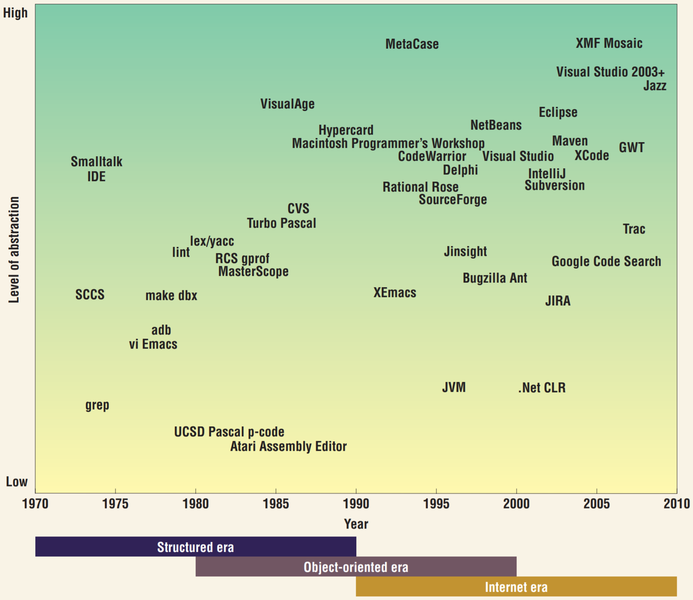

## 6.1 软件开发工具的发展现状

1. 软件开发工具的国外发展状况

   - 针对这种分散应用的弱点，提出了一体化的要求。IBM 在 1989 年提出的 AD/Cycle：关于应用系统开发和 CASE 工具的总框架
   - 到 1992 年，已有 30 余种产品面世，比较著名的有用于项目管理与质量管理的 ADPS；用于 AS/400 的一体化工具 ADT
   - 目前真正一体化的，又能应用于各种平台上的工具尚不多。比较多的两种工具：
     - 一是用于特定平台上的主要用于设计阶段的工具，如 Oracle 的 CASE，INFOMAX 的 NEW Era，IBM 的 VisualAge，以及 Power Builder，Power House。
     - 一种是侧重于分析方法的、独立于平台的工具，比如 Rational Rose、MARK V。

2. 软件开发工具的国内发展状况
   - 八十年代初期，软件工作环境的概念被介绍到国内。许多大学及研究单位也进行了相应的研究开发工作，比如 AutoDbase III 以及许多报表生成器、自动屏幕设计工具、自动菜单设计工具、QuickMIS 等产品。
   - 从研究的水平来看，国内的水平并不比国外低多少，主要的落后点在于应用，即没有广泛地使用这些工具。
   - 总的来说，我国的软件产业还没有形成一批稳定的、高度有组织的软件开发群体，因而真正能够发展软件开发工具的环境与社会需求还不具备。
   - 当务之急是大力普及软件工程及方法学的知识，提高软件开发工作的水平，这才能使软件开发工具的应用具有实践的基础。

- **真题**
  - 1.  为提高我国软件开发工作的水平，使软件开发工具的应用具有实践的基础，应大力普及的知识是``

## 6.2 软件开发工具的发展方向与趋势

1. 软件开发工具的发展方向

   - 1）智能化
   - 2）软件化
   - 3）一体化
   - 4）标准化

2. 软件开发工具的发展轨迹
   - 多样性和趋同性并存
   - 事实已经证明，这种用一种语言、一个环境包罗万象的企图是无法实现的。宇宙和社会的极端复杂性，应用领域的变化莫测，必然导致语言和工具的多样性。
   - 如果深入进行比较，不难看到在功能、系统结构、数据结构、使用方式甚至界面设计等许多方面，这些工具也呈现出明显的趋同性。

- **真题**
  - 1.  软件开发工具一体化的理论基础是``
  - 2.  软件开发工具一体化的困难在于``
  - 3.  作为对软件开发环境的要求，开发人员希望可以在代码编写过程中能把精力集中到``
  - 4.  为实现软件开发工具一体化提供理论基础的是``

## 6.3 从计算机语言发展而来的工具

1. 从计算机语言发展而来的工具

- 

- **真题**
  - 1.  作为一款著名软件工具，并行版本系统（CVS）出现于``
  - 2.  下述关于 Visual studio 和 Eclipse 的说法中，错误的是``
  - 3.  下列各编程语言中，代码执行效率最低的是``
  - 4.  下列关于 Visual Studio 的说法中，错误的是``
  - 5.  谷歌代码搜索（Google Code Search）这款软件工具出现于``
  - 6.  关于 Java 语言的技术中，属于网络和 Wb 开发支持技术的是``
  - 7.  下列各编程语言中，对面向对象思想和技术支持程度最高的是``
  - 8.  软件工具 TurboPascal 出现于``
  - 9.  作为一款著名软件工具，Rational Rose 出现于``
  - 10. 下列各编程语言中，跨平台特性最好的是``

## 6.4 综合性的平台或开发环境

1. Visual Studio 与 Eclipse 的共同点

   - 两款软件都具有编译、运行等基本功能，以都具备了代码援助、语法高亮、错误预防等扩展功能，使得开发人员可以在代码编写的过程中及时排除基本的拼写、引用错误，把精力集中到代码逻辑和算法优化上。

2. Visual Studio 的特点

   - Visual Studio 与微软公司的其他产品的交互协同堪称浑然一体
   - 获得了更多的 windows 操作系统的支持、速度上比 Eclipse 有着较大的优势，在运行速度、代码提示显示速度等方面表现出众。

3. Eclipse 的特点
   - Eclipse 是一款免费、面向各平台开发者的软件开发环境
   - 与 Visual Studio 相比，Eclipse“大平台，小核心，多插件”的特点显得更富有灵活性。

## 复习题

1. 以自己接触过的软件开发工具为例，分析软件开发工具目前的发展水平以及与实际需要的差距。

   - 真正一体化而且能用于各种平台的工具不多，比较多的有两种，一种用于特定平台，主要用于设计阶段的工具。另一种侧重于分析方法，独立于平台的工具。

2. 讨论我国软件开发工具的研究与应用现状、提出推动我国这一领域工作的意见与办法。

   - 总的来说，我国的软件产业还没有形成一批稳定的、高度有组织的软件开发群体，因而真正能够发挥软件开发工具作用的环境与需求还不具备。
   - 因此，对于我国的软件产业来说，当务之急应是大力普及软件工程及方法学的知识，提高软件开发工作的水平，这才能使软件开发工具的应用具有实践的基础。

3. 讨论本系统、本行业、本地区的软件开发工具的使用情况，指出弱点与对策。
4. 总结自己对软件开发工具的认识和应用的状况，并考虑今后如何加强。
5. 人工智能技术在软件开发工具的发展中有什么作用？

   - 在软件开发工作中，存在着大量不确定的因素，人们常常需要用知识与经验来补充或加工。在软件开发工具的研究与使用中引入人工智能、神经网络等技术，使得软件开发工具对于不确定性的信息、模糊信息具有更强的处理能力，也可以提高处理信息的功能及效率。

6. 计算机网络的普遍使用对软件开发工具有什么影响？

   - 通过将网络引入软件开发工具，软件开发人员可以更方便地互通信息，共享知识，更便于掌握项目的进展情况、质量状况等，这就给软件重用、知识重用提供了新的机会，也提高了工作效率。

7. 试分析一体化软件开发工具的困难何在，以及今后的发展前景。

   - 困难：只有对软件开发中涉及的各种信息，以及在开发过程中它们的发生、变化、关系、一致性等有了完整深刻的理解，才能真正实现软件开发工具的一体化。
   - 发展前景：

8. 软件构件标准化的思想对软件开发工具有什么影响？
9. 总结自己学习本课程的心得与体会。
   - 软件开发工具的历史：机器语言 -> 汇编语言 -> 高级语言 -> 20 世纪 90 年代，软件开发进入了大量应用软件开发工具的阶段 -> 21 世纪，软件开发进入了规模更大、应用更广的阶段
   - 软件开发工具的现状：
   - 软件开发工具的发展：智能化；网络化；一体化；标准化；

## 百日题库-主观题

1. 【2022.04】简述 Eclipse 集成开发环境的特点。

   - 免费、跨平台、大平台、小核心、多插件。

2. 【2020.10】试分析软件开发工具一体化的困难。

   - 只有对软件开发中涉及的各种信息，以及在开发过程中它们的发生、变化、关系、一致性等有了完整深刻的理解，才能真正实现软件开发工具的一体化。

3. 【2019.10】从发展趋势来看，软件开发工具领域有哪些值得关注的方向？

   - （1）智能化
     （2）网络化
     （3）一体化
     （4）标准化

4. 【2018.10】人工智能技术在软件开发工具的发展中什么作用？

   - 在软件开发工作中，存在着大量不确定的因素，人们常常需要用知识与经验来补充或加工。在软件开发工具的研究与使用中引入人工智能、神经网络等技术，使得软件开发工具对于不确定性的信息、模糊信息具有更强的处理能力，也可以提高处理信息的功能及效率。

5. 【2017.10】计算机网络的普遍使用对软件开发工具有什么影响？

   - 通过将网络引入软件开发工具，软件开发人员可以更方便地互通信息，共享知识，更便于掌握项目的进展情况、质量状况等，这就给软件重用、知识重用提供了新的机会，也提高了工作效率。

6. 【2016.10】为什么说软件开发工具是个相当广泛的庞大谱系？

   - 因为在这个谱系的一端是从某些计算机语言，通过增添各种辅助功能发展出来的工具；而在另一端，则是从较为抽象的概念模式或过程模式出发设计的开发平台或开发环境。是计算机语言在开发方向上的延伸。

7. 【2016.04】怎样才能实现软件开发工具的一体化？
   - 对于软件开发中涉及的各种信息，以及在开发过程中它们的发生、变化、关系和一致性有完整与深刻的理解。
