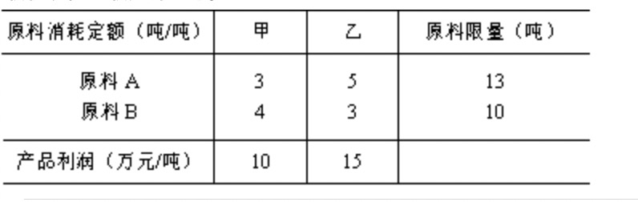
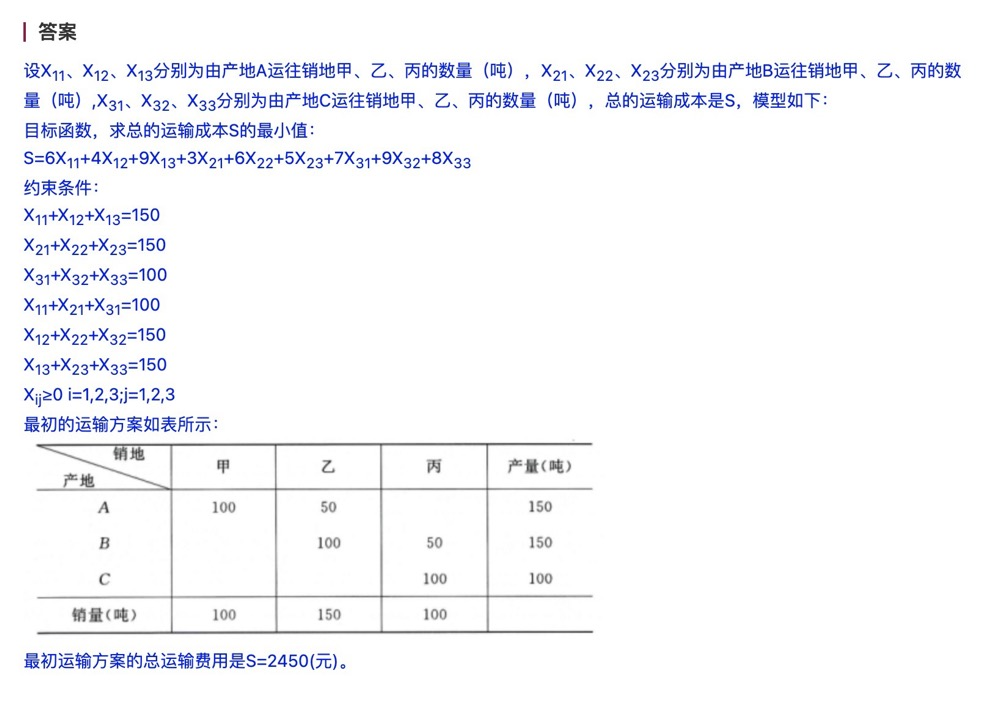

## 第 1 章 导论 无

## 第 2 章 预测

（三种题型：① 加权平均数预测法；② 指数平滑法；③ 简单滑动平均数预测法）

1.  【2022.10】某零售商销售某型号的打印机，1 至 3 月份的实际月销量依次为：105 台、102 台、109 台，试用`指数平滑法`，取平衡系数 α=0.6，预测第 4 个月该型号打印机的销售量。（第 1 个月专家预测值为 110 台）

    答：

         F_2 = F_1 + α(x_1 - F_1) = 110 + 0.6(105 - 110) = 107;
         F_3 = F_2 + α(x_2 - F_2) = 107 + 0.6(102 - 107) = 104;
         F_4 = F_3 + α(x_3 - F_3) = 104 + 0.6(109 - 104) = 107;
         第4个月该型号打印机的销售量预计有107台。

2.  【2020.08】某品牌的一款电饭锅在今年前五个月的月销量依次为：19、22、23、26、27（万个），现设定它们相对应的权数分别为 1、2、2、2、3，试用`加权平均数预测法`，预测第 6 个月该款电饭锅的销售量。

    答：

      

3.  【2020.10】某企业研制一新款无人飞行器，前 5 个月每架无人飞行器的生产成本依次为：3560 元、3545 元、3510 元、3550 元、3525 元，试用`简单滑动平均数预测法`，预测第 6 个月该新款无人飞行器的生产成本。

    答：

      

## 第 3 章 决策

（两种题型：① 不确定条件下的决策—最大最小决策标准或是最大最大决策标准；② 风险条件下的决策—最大期望收益值标准）

1. 【2021.10】某企业计划生产某款自动扫地机，拟定的价格有 A1、A2、A3三个方案，预计进入市场后可能的销售状态有三种，收益值如下表所示。试以`最大最小决策标准`作出该款自动扫地机价格的决策选择。
   

   答：

   
A1方案：min{600, 400, 300}=300

   A2方案：min{500, 450, 400}=400

   A3方案：min{400, 350, 350}=350

   max{300，400，350}=400，企业应以中等价格出售自动扫地机。
   

2. 【2020.10】某企业计划生产某款空气净化器，拟定的价格有 A1、A2、A3三个方案，预计进入市场后可能的销售状态有三种，收益表如下表，试以`最大期望收益值决策标准`作出该款空气净化器价格的决策选择。
   

   答：

   
A1方案：EP1=1000*0.3+800*0.5+600*0.2=820
  
   
A2方案：EP2=800*0.3+900*0.5+800*0.2=850

   
A3方案：EP3=700*0.3+700*0.5+600*0.2=680

   
Max{820,850,680}=850,企业应以中等价格出售空气净化器。

## 第 4 章 库存管理

（一种题型：计算`最佳订货批量 Nμ+最佳订货次数 Zμ`，2020 年考过最佳订货金额` Pμ=NμR`，背诵公式）

## 第 5 章 线性规划

（一种题型：写出`数学模型+图解法`求解，掌握单纯形法逻辑应对新题型）

1. 【2023.04】某公司利用两种原料 A、B 生产甲、乙两种产品（吨），单位产品所需的原料数、原料限量及单位产品所获利润如表。企业目标是追求利润的最大化，试写出该线性规划问题的数学模型，并用图解法求出最优解和最大利润。

   

   <!--  -->

<!-- 2. 【2022.04】某公司利用两种原料 A、B 生产甲、乙两种产品（吨），各产品每吨所需的原料消耗量（吨）、原料限量（吨）及单位产品所获利润（万元）如下表所示。企业目标是追求利润的最大化，试写出该线性规划问题的数学模型，并用图解法求出最优解和最大利润。
    -->

   <!--  -->

<!-- 3. 【2021.10】某公司利用两种原料 A、B 生产甲、乙两种产品，各产品的原料消耗量、原料限量及单位产品所获利润（万元）如下表所示。企业目标是追求利润最大化，试写出该线性规划问题的数学模型，并用图解法求出最优解和最大利润。
    -->

   <!--  -->

## 第 6 章 运输问题

（一种题型：写出`数学模型+西北角法求最初方案+最初方案总运输费用`—变量是两个下标，`记得要把最初方案的运输量乘相应成本算出总费用`，空格相当于无运输量，可忽略）

1. 【2023.04】已知某商品由产地 A、B、C 生产，并运往甲、乙、丙销地出售，产量、销量及单位运价如表所示。要求使总的运输成本最小，写出该运输问题的数学模型，并用西北角法求其最初运输方案及相应的总运输费用。  
   

   <!--  -->

<!-- 2. 【2022.04】已知某商品由产地 A、B 生产，并运往甲、乙、丙、丁销地出售，产量、销量及单位运价如下表所示。要求使总的运输成本最小，写出该运输问题的数学模型，并用西北角法求其最初运输方案及相应的总运输费用。
   

   

3. 【2021.04】一公司在 A、B、C 三个地区的分厂生产轮胎帘子线，并运往处于 Ⅰ、Ⅱ、Ⅲ 三个地区的经销商销售，产量、销量及单位运价如下表。试用西北角法求其最初运输方案及相应的总运输费用。
   

    -->

## 第 7 章 网络计划技术

（一种题型：`画网络图+计算结点时间+写出关键线路`，建议背诵活动四个时间的计算公式，以防考新题型）

1. 【2021.04】某工程有 7 项活动，有关数据如下表。试绘制该工程的箭线式网络图，求出各结点的时间参数并写出关键线路。
   

## 第 8 章 图论方法

（两种题型：① `最小树问题`—高铁、通讯网络、天然气、通信光缆、电话线；② `最短路问题`—从终点城市开始逆向推算）

1. 【2023.04】已知连接 5 个城市的公路交通图如图所示，现要在这 5 个城市间架设通信光缆，设计规定通信光缆线沿公路架设。如果在两城市间架设通信光缆，则其长度与图中对应城市间的公路长度一致，要求通信光缆线的总长度最小，试画出架设方案并求最小的通信光缆线总长度。（要求写出推导过程）  
   

   <!--  -->

2. 【2022.04】某旅行者要从甲地开车自驾游到乙地，中间可穿行的市镇与行车道路网络如题下图所示。试求从甲地到乙地的最短路线长度并画出最短路线图。  
   

   <!--  -->

## 第 9 章 马尔柯夫分析

（两种题型：① 已知当期的市场份额，需通过转移概率矩阵`求出下一期的市场份额`；② `求平衡状态时的市场份额`，题目有时会给出当期市场份额来混淆视线，实质运算过程中只需要用转移概率矩阵列方程组）

1. 【2023.04】已知甲、乙、丙三家糕点店同时向本地供应，今年初它们分别占有本地市场份额的 40%、40%、20%。根据调查，今后甲公司保有其顾客的 80%，丧失 10%给乙，丧失 10%给丙；乙公司保有其顾客的 70%，丧失 20%给甲，丧失 10%给丙；丙公司保有其顾客的 70%，丧失 20%给甲，丧失 10%给乙。试求在平衡时各家的市场份额。

<!--  -->

2. 已知今年 1 月初，甲、乙、丙三家网约车分别占有本地市场份额的 35%、30%、35%。根据调查，今后甲公司保有其顾客的 90%，丧失 5%给乙，丧失 5%给丙；乙公司保有其顾客的 85%，丧失 10%给甲，丧失 5%给丙；丙公司保有其顾客的 85%，丧失 10%给甲，丧失 5%给乙。试求明年初三家公司各占的市场份额。

<!--  -->

## 第 10 章 盈亏分析模型

（一种题型：求盈亏平衡点的产量 Q0 为必考内容，再附加考一个其他公式，`需背诵——获利 XX 时的产量 Q、生产能力百分率、边际收益率、盈亏平衡点的销售总收入 I、总可变成本 V、预期利润 S`）

## 第 11 章 模拟的基本概念

（一种题型：求概率+累计概率，`以表格的形式作答`）

1. 【2023.04】已知某飞机场 100 次飞机起飞延误时间统计记录如表，试求每种可能的起飞延误时间的概率，并求出累计概率。
   

   <!--  -->

<!-- 2. 【2022.10】已知某型号扫描仪在过去 50 天内销售记录如题下表。试求每种可能的销售量值的概率，并求出累计概率。
    -->
