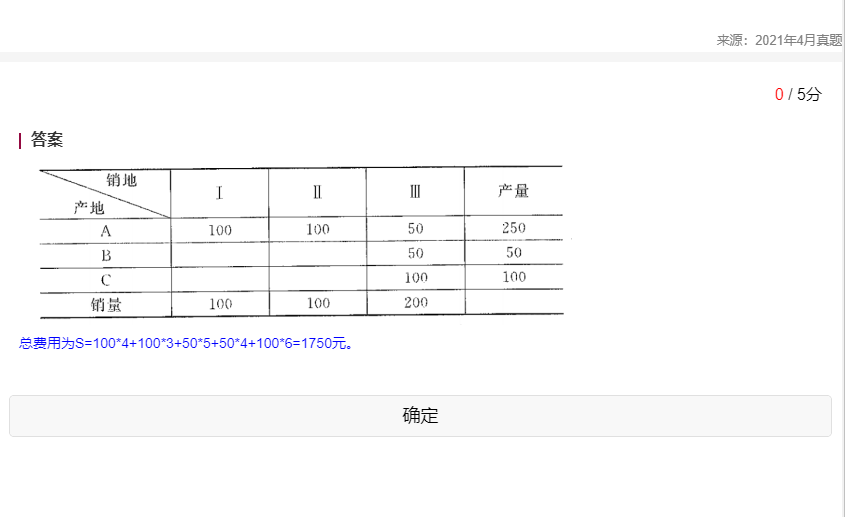

## 第 1 章 导论 无

## 第 5 章 线性规划

1. 【2023.04】某公司利用两种原料 A、B 生产甲、乙两种产品（吨），单位产品所需的原料数、原料限量及单位产品所获利润如表。企业目标是追求利润的最大化，试写出该线性规划问题的数学模型，并用图解法求出最优解和最大利润。

   

   

2. 【2022.04】某公司利用两种原料 A、B 生产甲、乙两种产品（吨），各产品每吨所需的原料消耗量（吨）、原料限量（吨）及单位产品所获利润（万元）如下表所示。企业目标是追求利润的最大化，试写出该线性规划问题的数学模型，并用图解法求出最优解和最大利润。  
   

   

3. 【2021.10】某公司利用两种原料 A、B 生产甲、乙两种产品，各产品的原料消耗量、原料限量及单位产品所获利润（万元）如下表所示。企业目标是追求利润最大化，试写出该线性规划问题的数学模型，并用图解法求出最优解和最大利润。  
   

   

## 第 6 章 运输问题

1. 【2023.04】已知某商品由产地 A、B、C 生产，并运往甲、乙、丙销地出售，产量、销量及单位运价如表所示。要求使总的运输成本最小，写出该运输问题的数学模型，并用西北角法求其最初运输方案及相应的总运输费用。  
   

   

2. 【2022.04】已知某商品由产地 A、B 生产，并运往甲、乙、丙、丁销地出售，产量、销量及单位运价如下表所示。要求使总的运输成本最小，写出该运输问题的数学模型，并用西北角法求其最初运输方案及相应的总运输费用。  
   

   

3. 【2021.04】一公司在 A、B、C 三个地区的分厂生产轮胎帘子线，并运往处于 Ⅰ、Ⅱ、Ⅲ 三个地区的经销商销售，产量、销量及单位运价如下表。试用西北角法求其最初运输方案及相应的总运输费用。  
   

   

## 第 11 章 模拟的基本概念

1. 【2023.04】已知某飞机场 100 次飞机起飞延误时间统计记录如表，试求每种可能的起飞延误时间的概率，并求出累计概率。
   

2. 【2022.10】已知某型号扫描仪在过去 50 天内销售记录如题下表。试求每种可能的销售量值的概率，并求出累计概率。
   
