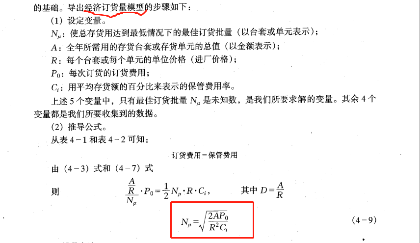
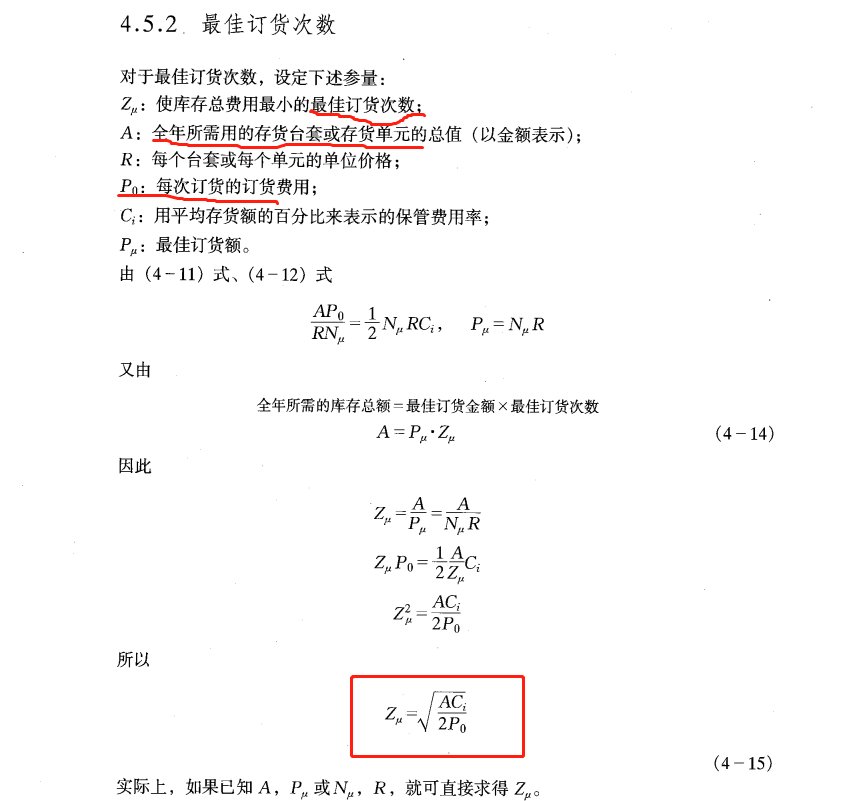

# 第 4 章 库存管理

企业为了保证生存和供应的连续性和均衡性，需要在不同生产和供应环节设立仓库，储备一定数量的物资（原材料、在制品、成品等）。

库存管理的对象是很多的，它可以包括：商业企业库存的商品、图书馆库存的图书等等。

对于工业企业的库存管理，它主要包括下列三个部分：

1）没有经过企业加工，而为企业或其他方面所需要的原材料、燃料、半成品、部件等；  
2）已经经过企业加工，但尚未加工完毕的在制品；  
3）企业已经加工完毕，储而待销的成品与备件等；

## 4.1 库存管理的作用和意义

#### 4.1.1 库存管理的作用

库存的作用最基本的一个方面就是保证工业企业的生产能够正常地、连续地、均衡地进行。具体来说，库存的作用可分为下列几种：

1）适应原材料供应的季节性 2）适应产品销售的季节性 3）适应运输上的合理性和经济性 4）适应生产上的合理安排 5）适应批发量的大小

#### 4.1.2 库存管理的意义

库存管理的意义或者说库存管理的目标，主要可以概括为 2 点：

1）保证企业按科学的计划实现均衡生产，不要因缺少原材料或其他物资而停工停产。  
2）使库存管理的总费用达到最低。

## 4.1.3 库存管理的内容

库存管理工作的主要内容，就是通过调节和控制存储的输入和输出的关系，来寻求最佳的经济效益。具体来说，主要包括：

1）确定经济采购量或经济生产批量 2）确定一个合适的订购提前量 3）确定一个合适的安全库存量 4）计算最小库存费用 5）提出行之有效的管理与控制方法

## 4.2 库存管理的存货台套法与 ABC 分类管理

#### 4.2.1 库存管理的存货台套法

存货台套简称存货单元，例如面包店的面粉单元，该单元可以包括各种规格的面粉。

存货台套法的内容是：以`存货台套`作为`存货管理的单位`，在某个存货台套种可以包括有关的各种单项存货。

#### 4.2.2 库存管理的 ABC 分析法

`ABC 分析法`就是`按照`各种存货台套或存货单元的年度`需要价值`，将它们分为 A、B、C 三类。

1）A 类存货台套，占年度需要价值的 70%，占全部存货台套数的 10%  
2）B 类存货台套，占年度需要价值的 20%，占全部存货台套数的 30%  
3）C 类存货台套，占年度需要价值的 10%，占全部存货台套数的 60%

## 4.3 库存费用分析和平均库存的概念

建立`库存模型`主要是为了探讨`库存数量`与`库存费用`之间的关系。即在保证生产正常进行的情况下，寻求使`库存费用最低的采购量或生产批量`。

#### 4.3.1 库存费用分析

1. 库存费用模型结构

   企业的仓库一般可以分为原材料库和半成品、成品库两类。为了建立库存模型的需要，必须了解各类仓库库存费用的构成情况。

   1）`原材料库库存费用模型`结构：**库存费用 = 订货量 + 保管费 （TC = P + C）**  
   2）`半成品和成品库库存费用模型`结构：**库存费用 = 工装调整费 + 保管费 （TC = S + C）**

上述两类仓库的库存模型结构，涉及到下述三种费用

2.  库存费用

- 1）订货费用： 订货费 = 年需要量/订货量 \* 一次订货费

  包括采购人员工资、办公费、差旅费、手续费、等

- 2）工装调整费： 工装调整费 = 年计划产量/生产批量 \* 一次工装调整费

  是指在批量生产情况下，每批投产前的工艺装备、工卡具和设备的调整以及检验所需费用。

- 3）保管费用： 保管费 = 平均库存量 \* 单位物资保管费

  保管费用是与库存物资有关的费用，包括仓库建筑物和`设备折旧`、`保险费`、`管理费、搬运费、维修费、保管期间物资流失变质的损失费等，这些均属保管费`。

#### 4.3.2 平均库存的概念

在推导经济批量库存模型之前，必须对库存的单项品种的采购做出一定的假设。为了对平均库存的概念的理解，下面引入平均库存量和平均库存额，并予以说明。

1. 平均库存量

   平均库存量等于批量大小的一般。平均库存受订货量和每年订货次数的影响。

2. 平均库存额

   平均库存额也称平均存货额。 计算公式：平均库存额 = 每个单元或每个台套的单位价格（库存物质单位）\* 平均库存量

## 4.4 经济订货量的计算方法

`经济订货量`是使总的`存货费用达到最低的`为某个台套或某个存货单元确定的最佳的`订货批量`。

#### 4.4.1 表格计算法

表格计算法使求解经济订货量的方法之一。这个方法的步骤是：

    1）选择一定数目的每次可能购买的数量方案；2）确定每种方案的总费用；3）选出总费用最小的订货量；

#### 4.4.2 图解法

#### 4.4.3 数学方法

1. 代数方法
2. 导数方法

## 4.5 经济订货量公式的典型应用示例

#### 4.5.1 每次订货的最佳总金额

#### 4.5.2 最佳订货次数

## 4.6 订货时间的确定

概括地说，确定性库存模型的前提是：使用量和提前时间都是恒定的。

为了保证生产过程能均衡地按计划进行，必须在某项存货尚未用完之前，就开始该项存货的再次订货。

在库存的管理中，对 A 类原材料及 A 类其它物资的管理，除了进行经济订货量的计算以外，另一个重要的管理问题就是订货时间的确定。应该综合考虑下列有关的各个因素。

#### 4.6.1 再订货点

再订货点有两种含义：一种是时间上的含义，即什么时间为某项存货再订货；另一种是存货水平上的含义，即某项存货达到怎样的存量水平时，就应再订货。

#### 4.6.2 前置时间

前置时间又称为订货提前期。

#### 4.6.3 前置时间内的需求量

#### 4.6.4 缺货

`缺货`是指仓库中已没有某项存货可以满足生产需要或销售需要时的状况。

#### 4.6.5 安全库存量

`安全库存量`亦可以称为保险库存量。安全库存量是为了预防可能出现的缺货现象而保持的额外库存量。

#### 4.6.6 关于在制品的定产时间问题

## 4.7 正确估价供应商所提供的数量折扣

#### 4.7.1 大批量采购的优缺点

大批量采购的优点

1）可以按较低的单位价格采购；2）可以减少订货次数，降低订货费用；3）大批量采购也可以大批量运输，获得运价优惠；4）减少缺货的可能性

大批量采购的缺点

1）保管费用高；2）需要占用更多的资金；3）库存货物会变得陈旧、过时；4）库存货物的更换率较低；5）适应时尚的灵活性较低；6）由于库存量增大，损耗会增大，货物贬值的可能性也会增大；

#### 4.7.2 正确评价供应者所提供的数量折扣
