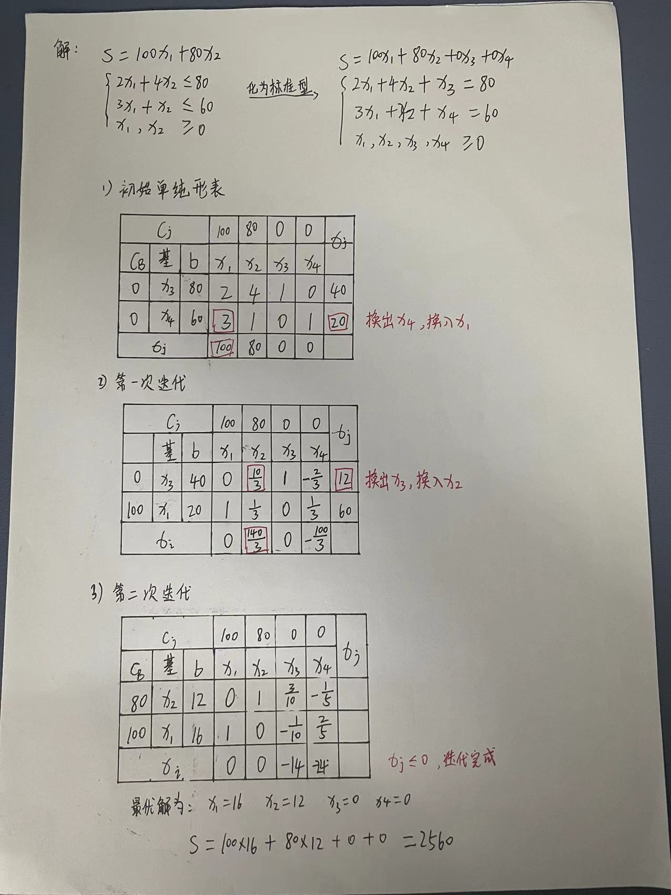

## 5.1 概述

生产和经营管理中经常提出如何合理安排，使人力、物力等各种资源得到充分利用，获得最大的效益，这就是规划问题。

1. 线性规划是一种合理利用资源、合理调配资源的应用数学方法。
2. 规划：就是`使用某种数学方法使有效资源的运用达到最优化`。规划就是计算，以数学形式表达的一定条件下的一组方程式和/或一组不等式中求某些未知量。
3. 规划的目的：就是现有的人力，物力和财力等资源条件下耗费的资源最少，从而获得的收益最大
4. 规划的任务：
   1 计划任务确定，用最少的资源来实现任务。  
   2 资源数量确定，合理利用，使完成的任务最大。  
   综合来说，是研究投入产出的极值问题，就是用最少的劳力和物力消耗，获得更多更好的社会需求产品。

## 5.2 线性规划的模型结构

1. 线性规划

   线性规划是一组变量的值，在满足一组约束条件下，求得目标函数的最优解，使决策目标达到最优。

2. 线性规划的基本特点

   是模型中的线性函数。线性是用来描述在两个或者多个变量之间的关系是直接成正比例的。

3. 线性规划的模型结构

   1）变量 2）目标函数 3）约束条件 4）线性规划的变量应为正值

4. 线性规划建模的步骤

   1）明确问题，确定目标，列出约束因素。 2）收集资料，确立模型。 3）模型求解与检验。 4）优化后分析。

## 5.3 线性规划的图解法

模型列出之后就需要求解。线性规划的基本解法有图解法和单纯形法两种。

`图解法`有称为几何解法，一般只适用于解 2~3 个变量的线性规划问题，实用价值不大，但它阐明了线性规划问题的基本原理。

`单纯形法`是一种解多变量的常用解法，变量少可用手算，变量多的复杂模型可用专用程序上机计算。

1. 求最大值问题
   线性规划图解法，一般要分为两步进行：  
   1）求满足约束条件的可行解区（可行域）  
   2）从可行解区内，找满足目标函数的最优解。

2. 求最小值问题（例子 5-2， p72）

## 5.4 线性规划的单纯形法

在线性规划中，可把变量分为基变量和非基变量。基变量的个数等于约束方程的个数，基变量可以用非基变量来表示。例如当确定增加的松弛变量 k1,k2 为基变量时，可以用非基变量 x1,x2 来表示。  
 通解：将基变量用非基变量来表示。  
 特解：给非基变量一个具体的值，可求出基变量的值。  
 可行解：特解求出来的值满足约束方程组和变量非负数的要求。  
 基解：所有的非基变量都等于 0，也是一个特解
可行基解：当基解满足非负的要求时，也叫可行基解。对于某个线性规划问题，若有最优解，那么这个最优解必定是某个基变量组的可行基解。
当基变量换了，则对应的通解、特解、基解、可行基解都会变。

1.  一般最大值问题的求解法（例子 5-3， p74）

    

    

2.  一般最小值问题的求解法（例子 5-4， p82）

## 5.5 线性规划应用示例

1. 原料投入的混料问题
2. 生产计划中产品搭配问题
3. 季节产品修匀的应用（例子 5-9， p90）

## 作业题（p92）

1. 线性规划的定义是什么？
2. 阐述线性规划的模型结构。
